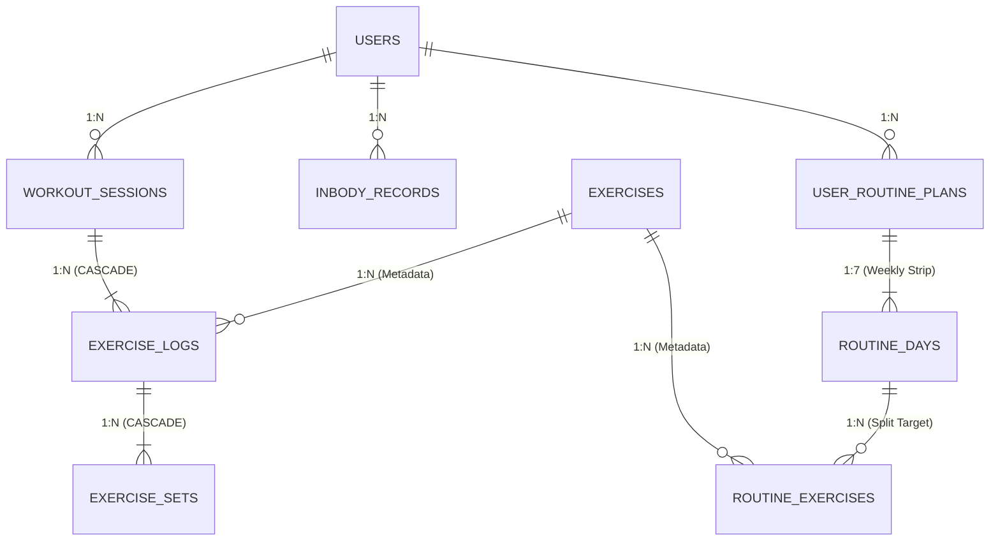

# AGENTS.md - FitPulse Master Architecture & Agent Operational Guidelines

이 문서는 Antigravity 및 모든 전담 서브에이전트(`design-agent`, `qa-agent` 등)가 본 프로젝트의 맥락, 기술 스택, 디자인 시스템, 도메인 비즈니스 로직, SOLID 객체지향 표준 및 작업 프로토콜을 완벽히 이해하고 수행하도록 정의한 **단일 진실 공급원(Single Source of Truth)** 가이드라인입니다.

---

## 1. 프로젝트 개요 (Project Overview)
- **서비스 명**: FitPulse (건강/헬스 기록 및 점진적 과부하 성장 분석 서비스)
- **핵심 가치**:
  1. **요일별 분할 루틴 스케줄러 (Weekly Split Routine Planner)**: 사용자의 훈련 분할(월: 가슴/삼두, 화: 등/이두, 수: 하체, 목: 휴식, 금: 어깨, 토: 하체2차/전신, 일: 휴식)을 시각화하고 당일 예정된 종목과 세트를 원클릭으로 시작.
  2. **종목별 세트 및 무게(kg)/반복수(reps) 간편 기입**: 헬스장에서 한 손으로 간편하게 조작할 수 있는 퀵 중량 칩(`-2.5`, `+2.5`, `+5`)과 반복수 스테퍼, 완료 체크 및 실시간 총 볼륨/1RM 즉시 연산.
  3. **깃허브(GitHub) 잔디 히트맵 (Activity Heatmap)**: 16주간의 출석 및 세션 볼륨 강도(0~4단계)를 네온 볼트 그리드로 시각화.
  4. **지난 세션 대비 총 볼륨 증감 비교**: 동일 부위 직전 세션 대비 `+kg` 및 `+%` 점진적 과부하(Progressive Overload) 달성률 즉각 피드백.
  5. **인바디 기반 맞춤 중량 추천기**: 체중, 골격근량, 체지방률, 경력 슬라이더 조절 시 3대 운동(SBD) 및 주요 종목의 웜업/본세트/스트렝스 중량 산출.
  6. **디자인 MVP 및 UI/UX 점검용 모바일 시뮬레이터 (390px~420px)**: 실제 스마트폰 환경(Apple iPhone / Android)과 데스크톱 와이드 뷰를 원클릭으로 전환하여 터치감과 시인성 사전 점검.

---

## 2. 팬톤(PANTONE®) 글로벌 스포츠 컬러 시스템 & WCAG 2.1 AAA 규격

본 프로젝트는 어두운 헬스장 환경(Gym Floor Low-Light) 및 OLED 디스플레이에서 압도적인 식별력을 발휘하도록 **WCAG 2.1 AAA (대비율 7:1 ~ 18:1)** 등급을 철저히 준수합니다.

### 2.1 다크 테마: 옵시디언 카본 (Obsidian Carbon OLED)
| 색상 명칭 | 팬톤 코드 및 HEX | 명도 대비율 | 디자인 의도 및 적용처 |
| :--- | :--- | :---: | :--- |
| **Primary Hero** | **Pantone 2288 C** (Nike Volt) `#CCFF00` / `#D4FF00` | **15.6:1 ~ 18.2:1** | 어두운 카본 배경 위에서 최고의 망막 식별력. Today 강조 뱃지, 주 액션 CTA(검정 볼드 텍스트 결합), 히트맵 4단계, 진행률 인디케이터. |
| **Secondary Accent**| **Pantone 2995 C** (Electric Cyan) `#00B4D8` / `#38BDF8` | **8.2:1** | 상체/스킬 트레이닝 태그, 볼륨 분석 차트 막대, 체지방률 슬라이더, 서브 상태 칩. |
| **Danger / Deload** | **Pantone 1788 C** (Vivid Crimson) `#FF334B` / `#FF3B56` | **5.4:1** | 디로드/볼륨 감소 경고, 주말 고강도 파워 데이, 위험 중량 경고, 삭제 액션. |
| **Focus / Streak** | **Pantone 1375 C** (Cyber Gold) `#FFB703` / `#F59E0B` | **8.9:1** | 연속 운동 스트릭(🔥 Flame), 웜업 세트 구분 인디케이터, 휴식일 회복 안내. |
| **Surface Void** | Obsidian True Carbon 900 `#09090B` / `#0A0A0E` | Base Void | OLED 순수 블랙 급 최하단 배경 (빛 번짐 최소화, 배터리 효율 극대화). |
| **Surface Card** | Obsidian True Carbon 850 `#111115` / `#121217` | Surface L1 | 기본 콘텐츠 카드, 7-Day 스트립 바, 세트 컨테이너 표면. |
| **Surface Hover** | Obsidian True Carbon 800 `#18181F` / `#1F1F2A` | Surface L2 | 호버 및 활성화된 리스트 아이템, 모달 내부 섹션. |
| **Border Crisp** | Obsidian Carbon Hairline `#23232D` / `#272732` | **4.8:1** | 0.5px~1px 초슬림 헤어라인 경계선 (빛 번짐 없는 정밀 카드 분할). |
| **Typography** | Pure White / Cool Grey `#FFFFFF` / `#94A3B8` | **18.2:1 / 6.8:1** | 수치 및 종목 헤드라인(Pure White), 세트 가이드 설명(Cool Grey). |

### 2.2 라이트 테마: 스포츠 클린 화이트 (Sport Crisp Clean White)
야외 직사광선 및 밝은 실내 환경에서 눈부심 없이 선명한 인식을 보장하는 팬톤 기반 주광색 테마:
| 색상 명칭 | 팬톤/HEX | 명도 대비율 | 디자인 의도 및 적용처 |
| :--- | :--- | :---: | :--- |
| **Primary Hero (Plate)** | **Pantone 2288 C** (Nike Volt) `#D4FF00` | **15.6:1** (w/ `#09090B`) | 흰 배경 위에서는 Volt 단독 텍스트 사용 금지(1.25:1 대비). **Volt 배경 뱃지 + Black 볼드 텍스트** 조합 또는 **Deep Volt Lime(`#3F6212` / `#4D7C0F`, 7.4:1)**으로 렌더링. |
| **Secondary Accent**| **Pantone 2995 C** (Cobalt/Cyan) `#0284C7` / `#0369A1` | **7.1:1** | 라이트 배경에 맞춰 명도를 낮춘 고대비 테크니컬 블루. |
| **Danger / Deload** | Vivid Crimson `#DC2626` / `#B91C1C` | **6.1:1** | 디로드/과부하 감소 및 삭제 액션. |
| **Surface Base** | Pure Crisp Studio White `#F8FAFC` / `#FFFFFF` | Base Void | 밝고 깨끗한 운동 스튜디오 배경. |
| **Surface Card** | Clean Slate Card `#FFFFFF` / `#F1F5F9` | Surface L1 | 입체감과 깊이감을 살린 카드 표면. |
| **Border Crisp** | Slate Border Hairline `#E2E8F0` / `#CBD5E1` | **3.8:1** | 세련되고 정밀한 경계선 분할. |
| **Typography** | Slate 900 / Slate 500 `#0F172A` / `#64748B` | **16.1:1 / 6.5:1** | 완벽한 WCAG AAA 가독성의 헤드라인 및 수치 표기. |

### 2.3 UI 요소 및 글자 비율 (Proportion & Hierarchy Rules)
1. **황금 비율 수치-단위 시각적 기준선 (Baseline Alignment)**:
   - 숫자(`JetBrains Mono`, 볼드)와 단위(`kg`, `회`, `일` 등)는 반드시 `flex items-baseline`으로 정렬.
   - 단위 텍스트는 수치 크기의 약 50~60% 크기(`text-xs`~`text-sm font-semibold`)를 유지하여 숫자의 시인성을 극대화.
2. **원터치 퀵 칩 & 스테퍼 조작성 (44px/36px 터치 면적)**:
   - `-2.5`, `+2.5`, `+5` 퀵 중량 칩은 최소 `min-h-[32px]~[36px]` 높이와 여유로운 패딩을 확보하여 조작 미스를 방지.
   - 세트 입력 12열 그리드는 **5(중량) : 4(반복수) : 3(완료 버튼)** 비율로 배분하여 390px 화면에서도 여유로운 터치 공간 제공.
3. **TODAY 뱃지 클리핑 방지**:
   - 7-Day 스트립 바는 상단 여백(`pt-3`)을 두어 오늘 뱃지가 카드 상단 경계선에 잘리지 않도록 안전 영역 확보.

---

## 3. 모바일 퍼스트 뷰포트 인체공학 (Anti-Squish Layout Rules)

스마트폰 프레임(390px ~ 420px) 안에서 글자가 세로로 찌그러지거나 잘리는 현상을 원천 방지하기 위해 에이전트는 다음 규칙을 반드시 지켜야 합니다:

1. **Anti-Wrapping 원칙**:
   - `바벨 벤치프레스`, `인클라인 덤벨 프레스` 등 한국어 종목명과 숫자/단위(`80kg`, `10회`, `4세트`)는 `whitespace-nowrap`과 `font-mono-num`으로 처리하여 폭이 좁은 390px 화면에서도 단어가 세로로 1글자씩 쪼개지지 않도록 방어합니다.
   - 긴 텍스트 컨테이너에는 `min-w-0`와 `truncate`를 선언합니다.
2. **단일 열(1-Column) 모바일 레이아웃**:
   - 모바일 시뮬레이터(`isMobileView === true`) 환경에서는 데스크톱 다단 그리드(`grid-cols-2`, `grid-cols-3`) 대신 여유로운 1단 리스트 카드 레이아웃을 사용합니다.
   - 4열 통계 카드는 모바일에서 2x2 그리드(`grid-cols-2 gap-2.5`)로 재배치합니다.
3. **엄격한 터치 타겟 (Apple HIG 기준 44pt+)**:
   - 땀이 묻은 손이나 장갑 착용 상태를 고려해 모든 버튼 및 스테퍼 탭 영역은 최소 **44 × 44px (`min-h-[44px]`)**를 보장합니다.

---

## 4. SOLID 소프트웨어 설계 원칙 준수

| 원칙 | 구현 및 적용 기준 | 해당 소스 파일 |
|---|---|---|
| **S (Single Responsibility)** | 연산 로직과 UI 렌더링을 엄격히 분리. `VolumeService`는 1RM/볼륨 계산만, `InBodyService`는 체성분 및 추천 중량만, `RoutineService`는 요일별 루틴 관리만 전담. | `src/services/calculator/VolumeService.ts` `src/services/calculator/InBodyService.ts` `src/services/routine/RoutineService.ts` |
| **O (Open/Closed)** | 신규 운동 종목 및 부위별 계수는 기존 계산 엔진을 수정하지 않고 `registerExercise()`를 통해 런타임 확장 가능. | `src/services/calculator/InBodyService.ts` |
| **L (Liskov Substitution)** | `IStorageService` 인터페이스를 구현한 `LocalStorageService`는 추후 `IndexedDBStorageService`나 `ApiStorageService`로 코드 수정 없이 100% 대체 가능. | `src/services/storage/IStorageService.ts` `src/services/storage/LocalStorageService.ts` |
| **I (Interface Segregation)** | 거대한 단일 모델 대신 목적별로 분리된 도메인 인터페이스 설계 (`IExerciseSet`, `IExerciseLog`, `IWorkoutSession`, `IInBodyData`, `IWeeklyRoutineDay`). | `src/models/fitness.ts` `src/models/routine.ts` |
| **D (Dependency Inversion)** | 모든 컴포넌트와 비즈니스 로직은 구체적인 `localStorage` 호출 대신 추상화된 `IStorageService` 인터페이스에 의존. | `src/services/storage/IStorageService.ts` |

---

## 5. 엔티티 관계 다이어그램 및 데이터 모델 (ERD Specification)

본 프로젝트는 확장 가능한 관계형/문서형 데이터베이스 설계를 위해 [`docs/ERD.md`](./docs/ERD.md)에 상세 스키마 및 관계를 정의하고 있습니다.

- **주요 엔티티**: `USERS`, `WORKOUT_SESSIONS`, `EXERCISE_LOGS`, `EXERCISE_SETS`, `EXERCISES`, `INBODY_RECORDS`, `USER_ROUTINE_PLANS`, `ROUTINE_DAYS`, `ROUTINE_EXERCISES`.
- **연쇄 무결성 (Referential Integrity)**: 운동 세션 삭제 시 소속된 종목 및 세트 자동 CASCADE 삭제.
- **인덱스 설계**: `(user_id, session_date DESC)` 복합 인덱스로 16주 잔디 히트맵과 직전 세션 대비 점진적 과부하 볼륨 연산을 $O(\log N)$ 최적화.

---

## 6. 전담 서브에이전트 역할 및 운영 프로토콜

본 프로젝트는 전문화된 서브에이전트 시스템을 기반으로 운영됩니다:

### 5.1 `design-agent` (수석 UI/UX & 디자인 시스템 에이전트)
- **책임**:
  - 팬톤(Pantone 2288 C Volt) 고대비 색채 팔레트 규격 유지 및 WCAG 2.1 AAA 대비율 감수.
  - 모바일(390px) 뷰포트에서의 여백, 폰트 계층, 텍스트 줄바꿈 방지(Anti-Squish), 터치 타겟(44px) 검증.
  - Apple Fitness+ 및 Nike Training Club 스타일의 미니멀 프리미엄 감성 유지.

### 5.2 `qa-agent` (수석 QA & 품질 검증 엔지니어링 에이전트)
- **책임**:
  - 코드 변경 후 `npm run build` (`tsc && vite build`) 무결성 및 TypeScript Strict 모드 컴파일 검증.
  - 모바일 시뮬레이터 및 데스크톱 뷰에서 레이아웃 깨짐, 가로 스크롤 오버플로우, 버튼 잘림 현상 여부 검증.
  - 세트 추가/삭제, 중량 조정(-2.5/+2.5/+5), 반복수 스테퍼, 실시간 총 볼륨 및 Epley 1RM 연산 정밀도 검증.
  - 인바디 슬라이더 조절에 따른 3대 운동 추천 중량(2.5kg 원판 단위) 연산 유효성 검증.

---

## 6. 핵심 도메인 규칙 및 알고리즘

### 6.1 총 볼륨 (Total Volume) 및 세트 기입 규칙
- **단일 세트 볼륨**: $\text{Volume} = \text{중량(kg)} \times \text{반복 수(reps)}$ (완료된 세트만 산입)
- **세션 총 볼륨**: $\text{Total Session Volume} = \sum (\text{weight} \times \text{reps})$
- **볼륨 증감율**: $\Delta \text{Volume (\%)} = \frac{V_{\text{curr}} - V_{\text{prev}}}{V_{\text{prev}}} \times 100$

### 6.2 1RM (Epley 공식)
$$\text{1RM} \approx \text{Weight} \times \left(1 + \frac{\text{Reps}}{30}\right) \quad (\text{단, } \text{reps} \le 10 \text{ 권장})$$

### 6.3 잔디 히트맵 (Activity Heatmap) 강도 산정
- **Level 0**: 0 kg (휴식일, Obsidian `#0A0A0E`)
- **Level 1**: < 5,000 kg (가벼운 운동, `#182608`)
- **Level 2**: 5,000 ~ 12,000 kg (적정 강도, `#4D7C0F`)
- **Level 3**: 12,000 ~ 20,000 kg (고강도, `#A3E635`)
- **Level 4**: > 20,000 kg (극한 볼륨, High-Voltage Volt `#D4FF00` + Glow)

### 6.4 인바디 기반 추천 중량 알고리즘
- **제지방량 (FFM)**: $\text{FFM} = \text{Weight} \times (1 - \text{BodyFat} / 100)$
- **근육 충실도 (MF)**: $\text{MF} = \text{Skeletal Muscle Mass} / \text{Weight}$
- **훈련 추천 세트 중량 (2.5kg 단위 반올림)**:
  - 웜업 (12 reps): 추정 1RM의 50%
  - 근비대 본세트 (8~10 reps): 추정 1RM의 72%
  - 스트렝스 (5 reps): 추정 1RM의 82%

---

## 7. 에이전트 작업 시 불변 원칙 (Non-Negotiable Rules)
1. 모든 UI/UX 컴포넌트는 모바일 시뮬레이터(390px)와 데스크톱 양쪽 모두에서 테스트되어야 하며, 글자가 세로로 쪼개지는 현상이 발생해서는 안 된다.
2. 모든 수치와 텍스트는 팬톤 2288 C Volt 및 Deep Obsidian Carbon의 고대비 테마(WCAG AAA)를 준수해야 한다.
3. 코드 수정 후에는 반드시 `npm run build`를 통과하여 타입 에러가 0건임을 보장해야 한다.
4. 요일별 루틴, 종목별 세트 기입, 잔디 히트맵, 볼륨 증감 비교, 인바디 추천 중량 간의 데이터 연동이 끊김 없이 매끄럽게 연결되어야 한다.
