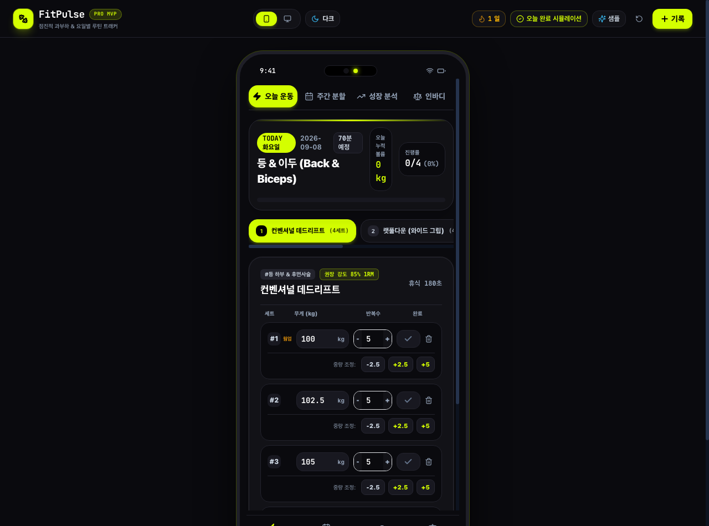
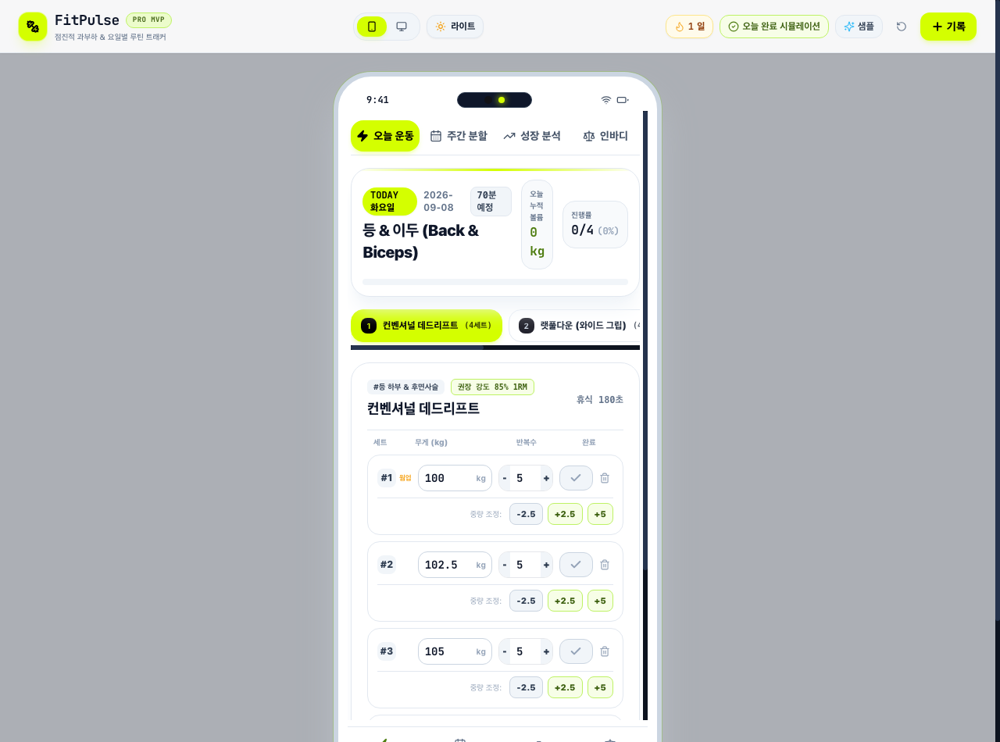
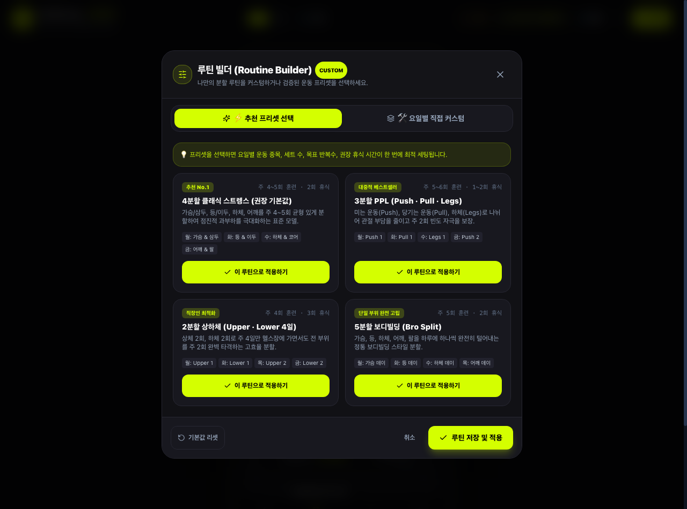
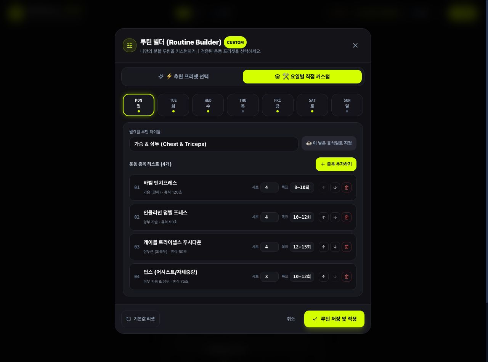
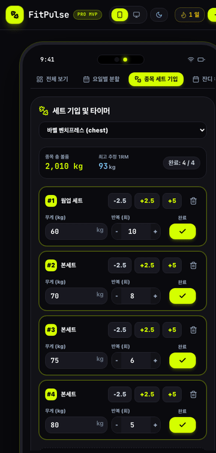
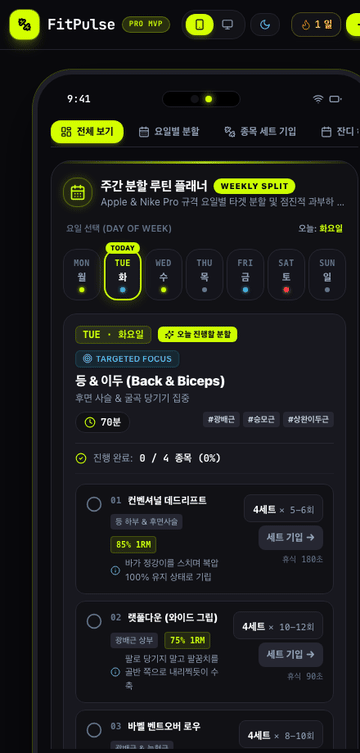
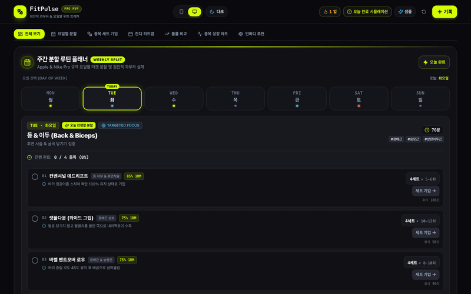

# FitPulse - 프로페셔널 헬스 볼륨 & 요일별 루틴 트래커 (MVP)

> **요일별 분할 루틴**, **종목별 세트 및 무게/반복수 간편 기입**, **GitHub 잔디 히트맵**, **지난번 대비 총 볼륨 증감 비교**, **인바디 기반 추천 중량기**를 갖춘 웹 MVP 프로토타입입니다.  
> 글로벌 프리미엄 스포츠 브랜드(Nike Pro, Apple Fitness+, Whoop) 기준의 **Pantone® 2288 C Volt & Deep Space Obsidian** 고대비 디자인 시스템과 **SOLID 객체지향 아키텍처**를 엄격히 준수합니다.

---

## ⚡ 빠른 시작 (Getting Started)

```bash
# 로컬 개발 서버 실행 (현재 http://localhost:5173 에서 상시 구동 중)
npm run dev

# 프로덕션 빌드 검증 (TypeScript 컴파일 & 번들링)
npm run build
```

---

## 🎬 사용자 중심 첫 화면: 오늘 워크아웃 HUD (Today's Active Workout Hero)

> 헬스장에 입장한 사용자가 앱을 켜자마자 **0-Click으로 당일 요일 루틴과 첫 번째 운동 종목의 세트 기입기가 즉각 나타나는** 싱글 포커스 HUD 레이아웃입니다.

| 메인 첫 화면: 다크 테마 (Nike Volt) | 메인 첫 화면: 라이트 테마 (Clean Studio White) |
| :---: | :---: |
|  |  |

---

### 🛠️ 나만의 분할 루틴 설계: 루틴 빌더 (Routine Builder)

> 추천 프리셋(4분할 · 3분할 PPL · 2분할 상하체 · 5분할 보디빌딩)을 원클릭으로 불러오거나, 요일별 운동/휴식일 지정, 종목 라이브러리 추가, 세트수 및 휴식시간을 자유롭게 커스텀할 수 있습니다.

| 추천 프리셋 선택 (Presets) | 요일별 직접 커스텀 (Custom Editor) |
| :---: | :---: |
|  |  |

---

## ⏱️ 핵심 인터랙션 데모 (Visual Tour & GIFs)

### ⏱️ 1세트 완료 시 오디오 효과음 & 휴식 타이머 자동 팝업


### 🌓 다크 / 라이트 테마 원클릭 실시간 전환


### 📱 핵심 4대 여정 (오늘 운동 · 주간 분할 · 성장 분석 · 인바디 추천기)


---

## 📚 에이전트 및 아키텍처 문서
- **엔티티 관계 다이어그램(ERD)**: [`docs/ERD.md`](./docs/ERD.md) - RDBMS 및 클라이언트 스키마, Mermaid 관계도, 외래키/인덱스 명세
- **마스터 에이전트 지침서**: [`AGENTS.md`](./AGENTS.md) - 에이전트 운영 프로토콜, SOLID 객체지향 표준, 팬톤 2288 C 규격, 도메인 공식
- **자동 탑재 규칙**: [`.agents/rules/fitpulse_rules.md`](./.agents/rules/fitpulse_rules.md) - Antigravity 시스템 상시 로드 룰
- **서비스 기능명세서**: [`docs/SPECIFICATION.md`](./docs/SPECIFICATION.md) - v1.2.0 기능 명세 및 유저 저니
- **전담 서브에이전트**:
  - `design-agent`: 팬톤 컬러 감수, WCAG 2.1 AAA 명도 대비 검증, 모바일 390px 인체공학적 레이아웃 설계
  - `qa-agent`: 빌드 무결성, 뷰포트 레이아웃 안정성, 볼륨/1RM 수식 검증

---

## 🌟 핵심 기능 및 UI/UX

1. **요일별 분할 루틴 플래너 (Weekly Split Routine)**
   - 월(가슴) ~ 일(휴식) 7-Day 분할 스트립 및 금일(`TODAY`) 자동 감지
   - 예정된 종목 목록 및 목표치 (`4세트 × 8회 @ 75kg`)
   - 세트 수행 체크리스트 및 실시간 달성률(%) 프로그레스 바
   - "오늘 루틴 시작" 클릭 시 오늘 운동 세션 자동 생성 및 세트 기입기 즉시 연동

2. **종목별 세트 & 무게/반복수 기입기 (Exercise Set Manager)**
   - 벤치프레스, 스쿼트, 데드리프트, OHP, 바벨로우 등 종목 선택
   - 원터치 퀵 무게 칩 (`-2.5`, `+2.5`, `+5 kg`) & 1회 단위 가감 스테퍼
   - 세트 완료 체크 토글 시 실시간 추정 1RM 및 종목 총 볼륨 자동 연산

3. **GitHub 스타일 잔디 히트맵 (Activity Heatmap)**
   - 16주간의 날짜별 운동량 및 볼륨 강도에 따른 5단계 네온 볼트 잔디
   - 연속 운동일수 (🔥 Streak) 및 누적 볼륨 통계

4. **지난번 대비 총 볼륨(Volume) 증감 비교**
   - 동일 부위 직전 운동 대비 `+kg` 및 `+%` 점진적 과부하(Progressive Overload) 달성률 피드백
   - 이번 세션 vs 지난 세션 듀얼 프로그레스 바 및 종목별 세부 증감 내역

5. **인바디 맞춤 중량 추천기**
   - 체중, 골격근량, 체지방률 실시간 슬라이더 연동
   - 3대 운동 합산(SBD) 및 웜업(12회), 본세트(8~10회), 스트렝스(5회) 권장 중량표 제공

6. **모바일 시뮬레이터 (390px ~ 420px) & 데스크톱 뷰포트**
   - 상단 헤더 원클릭 모드 전환
   - 스마트폰 화면에서 텍스트 수직 쪼개짐 현상 원천 차단 (Zero-Squish Layout)
