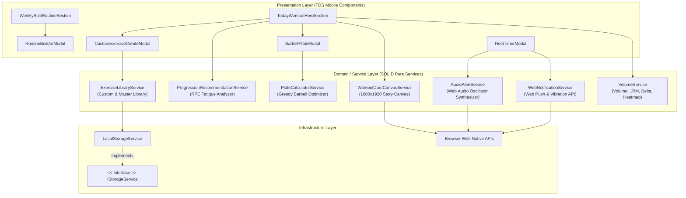
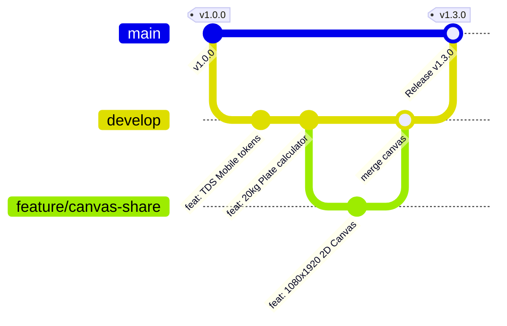

# FitPulse (핏펄스) · 당연한 것을 더 쉽고 명확하게

<div align="center">


<br/>

**"복잡한 운동 기록은 그만. 앱을 켜자마자 바로 세트를 시작하세요."**  
토스 디자인 시스템(TDS Mobile)의 철학과 클린 객체지향(SOLID) 아키텍처를 계승한 **차세대 프로페셔널 헬스 볼륨 & 요일별 루틴 트래커**입니다.

[⚡ 빠른 시작](#-빠른-시작-getting-started) • [🔥 Phase 1 킬러 기능](#-phase-1-킬러-기능-killer-features) • [🎨 TDS 디자인 시스템](#-토스-디자인-시스템-tds-mobile) • [🏛️ SOLID 아키텍처](#️-solid-5원칙-소프트웨어-아키텍처) • [📚 문서 인덱스](#-문서-인덱스-documentation-hub)

</div>

---

## 💡 프로젝트 철학: "당연한 것을 더 쉽고 명확하게"

1. **0-Click 접근성**: 헬스장에 들어서 앱을 켜는 순간, 오늘 요일 루틴과 첫 종목의 세트 기입기가 즉각 눈앞에 펼쳐집니다. 불필요한 탐색 depth를 0으로 줄였습니다.
2. **운동 몰입을 깨지 않는 인터랙션**: 지친 세트 간에 뇌를 쉬게 하세요. 20kg 바벨 원판 조합 계산, RPE 기반 다음 세트 무게 추천, 백그라운드 푸시 알림 & 햅틱 진동이 당신의 페이스를 완벽히 유지해 줍니다.
3. **자랑하고 싶은 순간의 시각화**: 외부 라이브러리 없이 1클릭으로 인스타그램 스토리 9:16 고해상도(1080×1920) '오운완' 인증 카드를 브라우저에서 즉시 생성합니다.
4. **엄격한 데이터 정합성 & 오프라인 완결성**: 네트워크가 끊기거나 백엔드 서버 점검 중에도 로컬 스토리지 계층을 통해 100% 무손실 세션 영속화를 보장합니다.

---

## ⚡ 빠른 시작 (Getting Started)

FitPulse는 Docker 멀티 스테이지 프로덕션 컨테이너 및 로컬 개발 환경을 모두 완벽히 지원합니다.

### Option 1. 크로스 플랫폼 Docker 원클릭 컨테이너 실행 (macOS & Windows WSL2 권장)

```bash
# 1) 초경량 Nginx 프로덕션 컨테이너 빌드 및 백그라운드 구동 (포트 3000)
docker compose up --build -d

# 2) 컨테이너 구동 상태 및 헬스체크 확인
docker compose ps

# 3) 브라우저 접속
# -> http://localhost:3000

# 4) 컨테이너 안전 종료
docker compose down
```

> **💡 개발용 핫 리로딩(HMR) Docker 환경이 필요한 경우:**
> ```bash
> docker compose --profile dev up dev  # http://localhost:5173
> ```

### Option 2. 로컬 Node.js 환경 직접 실행

```bash
# 의존성 패키지 설치
npm install

# 로컬 개발 서버 구동 (Vite HMR)
npm run dev
# -> http://localhost:5173 접속

# TypeScript 컴파일 및 프로덕션 번들 빌드 검증
npm run build
```

---

## 🔥 Phase 1 킬러 기능 (Killer Features)

FitPulse의 최신 업데이트에는 실제 헬스 유저들의 가장 뜨거운 요구사항을 해결한 **5가지 킬러 기능**이 탑재되어 있습니다.

| 킬러 기능 | 핵심 가치 및 사용자 경험 | 기술 구현체 |
|---|---|---|
| **📸 1클릭 오운완 인스타 스토리 카드** | 지저분한 화면 캡처 대신 **1080×1920 (9:16) 고해상도** 토스 블루 앰비언트 글로우 요약 카드를 브라우저에서 즉시 생성 및 PNG 다운로드 | [`WorkoutCardCanvasService`](file:///c:/Users/SSAFY/Desktop/project_heathcare/src/services/share/WorkoutCardCanvasService.ts) |
| **🏋️ 덤벨/머신/바벨 커스텀 종목 등록** | 헬스장 특화 머신, 케이블 변형 운동을 카테고리/타겟 근육/기본 세트수와 함께 자유롭게 등록 및 영구 보존 | [`ExerciseLibraryService`](file:///c:/Users/SSAFY/Desktop/project_heathcare/src/services/exercise/ExerciseLibraryService.ts)<br>[`CustomExerciseCreateModal`](file:///c:/Users/SSAFY/Desktop/project_heathcare/src/components/CustomExerciseCreateModal.tsx) |
| **🔔 백그라운드 웹 푸시 알림 & 햅틱 진동** | 쉬는 시간 중 인스타그램·유튜브로 화면을 전환해도 세트 종료 시 시스템 푸시 알림과 진동으로 정시 복귀 유도 | [`WebNotificationService`](file:///c:/Users/SSAFY/Desktop/project_heathcare/src/services/notification/WebNotificationService.ts)<br>[`RestTimerModal`](file:///c:/Users/SSAFY/Desktop/project_heathcare/src/components/RestTimerModal.tsx) |
| **⚖️ 20kg 올림픽 바벨 원판 조합 계산기** | 목표 중량(예: 102.5kg) 입력 시 봉 무게(20kg)를 제하고 양쪽에 꽂아야 할 원판 종류를 Greedy 알고리즘으로 최적화 시각화 | [`PlateCalculatorService`](file:///c:/Users/SSAFY/Desktop/project_heathcare/src/services/calculator/PlateCalculatorService.ts)<br>[`BarbellPlateModal`](file:///c:/Users/SSAFY/Desktop/project_heathcare/src/components/BarbellPlateModal.tsx) |
| **🧠 스마트 점진적 과부하 & RPE 피로도 분석** | 직전 세트의 RPE(피로도)와 과거 동일 종목 누적 볼륨을 결합하여 다음 세트 [무게, 횟수, 휴식시간]을 실시간 피드백 | [`ProgressionRecommendationService`](file:///c:/Users/SSAFY/Desktop/project_heathcare/src/services/calculator/ProgressionRecommendationService.ts) |

---

## 🎬 핵심 화면 및 인터랙션 갤러리

### 1. 오늘 워크아웃 HUD (Today's Workout Hero)
> 앱을 켜자마자 당일 요일 루틴과 첫 종목의 세트 기입기가 전면에 노출됩니다.

| 메인 다크 모드 (OLED Charcoal) | 메인 라이트 모드 (Toss Signature Grey) |
| :---: | :---: |
|  |  |

---

### 2. 나만의 분할 루틴 빌더 (Routine Builder)
> 4분할 · 3분할 PPL · 2분할 상하체 · 5분할 보디빌딩 프리셋을 1클릭 적용하거나 자유롭게 커스텀할 수 있습니다.

| 추천 프리셋 선택 (Presets) | 요일별 세부 커스텀 (Custom Editor) |
| :---: | :---: |
|  |  |

---

### 3. 무지연 오디오 차임 & 실시간 휴식 타이머
> 세트 완료 체크 시 Web Audio API 차임벨과 함께 자동 휴식 타이머가 카운트다운을 시작합니다.

<div align="center">


</div>

---

### 4. 테마 원클릭 실시간 전환 & 4대 사용자 여정
> 토스 라이트 / 다크 테마 전환 및 오늘 운동 · 주간 분할 · 성장 분석 · 인바디 추천기의 유기적 흐름.

| 다크 / 라이트 모드 즉시 토글 | 핵심 4대 사용자 여정 투어 |
| :---: | :---: |
|  |  |

---

## 🎨 토스 디자인 시스템 (TDS Mobile)

FitPulse는 토스(Toss) 특유의 고도화된 모바일 사용자 경험과 정갈한 시각 언어를 100% 충족합니다.

### 1. 컬러 팔레트 규격 (Color Tokens)

```
[Toss Signature Blue]
#3182F6  Primary Blue (CTA, 주요 뱃지, 액티브 탭)
#1B64DA  Primary Hover
#E8F3FF  Primary Weak Light (Soft Tint)
rgba(49, 130, 246, 0.16)  Primary Weak Dark

[Surfaces & Greys]
#101012  Dark Background (OLED Deep Charcoal)
#1C1C1E  Dark Elevated Card Surface
#2C2C2E  Dark Hairline Border
#F2F4F6  Light Background (Toss Signature Grey)
#FFFFFF  Light Card Surface
#E5E8EB  Light Hairline Border

[Semantic Accents]
#00BFA5  Teal (성공, 달성률 100%)
#00C73C  Green (히트맵 잔디, 안정)
#F04452  Red (한계 피로, 디로딩)
#FF9F00  Yellow (주의, 과부하)
```

### 2. 모바일 터치 친화적 아토믹 컴포넌트 (`src/components/tds`)
- **`TdsButton`**: `primary`, `secondary`, `weak`, `danger` 변형 및 누름 감각 햅틱 시각 피드백(`scale-[0.98]`).
- **`TdsBadge`**: 상태별 6종 컬러 매핑 및 `fill`/`weak` 듀얼 스타일 지원.
- **`TdsStepper`**: 땀 흘리는 헬스장에서도 오타를 방지하는 44px 최소 터치 규격 가감 스테퍼.
- **`TdsBottomCTA`**: 스마트폰 제스처 바에 겹치지 않는 Safe-Area 전용 고정 하단 액션 버튼.

---

## 🏛️ SOLID 5원칙 소프트웨어 아키텍처

FitPulse는 단순한 프로토타입을 넘어 소프트웨어 공학의 **SOLID 5원칙**을 충실히 반영한 클린 아키텍처를 자랑합니다.



### SOLID 매핑 요약
- **S (단일 책임 원칙)**: 볼륨 연산(`VolumeService`), 원판 계산(`PlateCalculatorService`), 캔버스 렌더링(`WorkoutCardCanvasService`), 웹 푸시/진동(`WebNotificationService`) 등 각 서비스가 단 하나의 비즈니스 영역만 전담.
- **O (개방-폐쇄 원칙)**: `IStorageService` 추상화를 통해 향후 IndexedDB, Supabase 클라우드로 확장 시 기존 로직 수정 없이 교체 가능.
- **L (리스코프 치환 원칙)**: `LocalStorageService`는 `IStorageService` 계약을 100% 준수하여 어디서든 대체 가능.
- **I (인터페이스 분리 원칙)**: 단일 거대 인터페이스를 배제하고 `IExerciseSet`, `INextSetRecommendation`, `IPlateCalculationResult` 등으로 잘게 쪼개어 불필요한 결합 차단.
- **D (의존성 역전 원칙)**: 전역 `window.localStorage` 하드코딩 대신 추상화 인터페이스를 통해 접근.

---

## 🌿 Git 브랜치 전략 및 배포 운영 원칙

FitPulse 프로젝트는 안정적인 릴리즈 주기와 품질 관리를 위해 엄격한 **Git-Flow 간소화 모델**을 준수합니다.



| 브랜치명 | 역할 및 운영 원칙 | 직접 커밋 허용 여부 |
|---|---|:---:|
| **`main`** | **프로덕션 배포 전용 브랜치**. 항상 무결성이 검증된 빌드만 유지되며, 배포 시 시맨틱 버저닝 태그(`v1.x.x`) 부여. | ❌ 절대 금지 (PR 승인 필수) |
| **`develop`** | **일상 기능 통합 및 차기 릴리즈 준비 브랜치**. 팀의 모든 개발 작업이 취합되는 메인 스트림. | ⚠️ 제한적 (기능 완성 머지) |
| **`feature/*`** | 단위 신규 기능 개발 브랜치 (`feature/barbell-plate`, `feature/push-notification` 등). 완료 후 `develop`으로 PR 머지. | ✅ 허용 |
| **`hotfix/*`** | 프로덕션 환경의 긴급 결함 수정 브랜치. 수정 완료 후 `main`과 `develop` 양쪽에 동시 반영. | ✅ 허용 |

---

## 📚 문서 인덱스 (Documentation Hub)

FitPulse는 체계적인 문서화와 단일 진실 공급원(Single Source of Truth) 원칙을 고수합니다.

| 문서명 | 경로 | 주요 내용 |
|---|---|---|
| **무료($0) 배포 및 운영 가이드** | [`docs/ZERO_COST_OPERATIONS_GUIDE.md`](file:///c:/Users/SSAFY/Desktop/project_heathcare/docs/ZERO_COST_OPERATIONS_GUIDE.md) | MAU 100명 기준 영구 월 0원 Netlify/PWA 배포 및 모바일 무료 설치 전략 |
| **모바일 크로스 플랫폼 전략 보고서** | [`docs/CROSS_PLATFORM_STRATEGY.md`](file:///c:/Users/SSAFY/Desktop/project_heathcare/docs/CROSS_PLATFORM_STRATEGY.md) | iOS/Android 양대 마켓 동시 진출을 위한 Capacitor/PWA/RN 심층 비교 및 로드맵 |
| **시스템 아키텍처 명세서** | [`docs/ARCHITECTURE.md`](file:///c:/Users/SSAFY/Desktop/project_heathcare/docs/ARCHITECTURE.md) | 계층형 클린 아키텍처, SOLID 5원칙 분석, 서비스 레이어 매핑, Web Native API 연동 |
| **기능 상세 명세서** | [`docs/FEATURES.md`](file:///c:/Users/SSAFY/Desktop/project_heathcare/docs/FEATURES.md) | Phase 1 킬러 기능 5종 + 핵심 기반 기능 유저 저니, 입출력 스펙, 엣지 케이스 |
| **서비스 PRD 기능명세서** | [`docs/SPECIFICATION.md`](file:///c:/Users/SSAFY/Desktop/project_heathcare/docs/SPECIFICATION.md) | v1.3.0 요구사항 정의서, TDS Mobile 토큰 규격, 기능별 요구사항(FR-01~10) |
| **데이터 모델 및 ERD** | [`docs/ERD.md`](file:///c:/Users/SSAFY/Desktop/project_heathcare/docs/ERD.md) | RDBMS/클라이언트 스키마, Mermaid 관계도, `CUSTOM_EXERCISES` 테이블 명세 |
| **경쟁사 심층 벤치마크** | [`docs/COMPETITIVE_ANALYSIS.md`](file:///c:/Users/SSAFY/Desktop/project_heathcare/docs/COMPETITIVE_ANALYSIS.md) | 번짐(BurnGym), 플랜핏(Planfit), 스트롱(Strong) 대비 차별화 우위 분석 |
| **사용자 UX 리서치 설문지** | [`docs/SURVEY.md`](file:///c:/Users/SSAFY/Desktop/project_heathcare/docs/SURVEY.md) | SUS 10문항, NPS, 헬스장 현장 경험 평가 실전 설문지 템플릿 |
| **마스터 에이전트 지침서** | [`AGENTS.md`](file:///c:/Users/SSAFY/Desktop/project_heathcare/AGENTS.md) | 다중 에이전트 협업 프로토콜, 도메인 계산 공식, 코드 컨벤션 가이드 |

---

<div align="center">

**FitPulse Team · Designed with Passion for Lifting**  
"당연한 것을 더 쉽고 명확하게"

</div>
