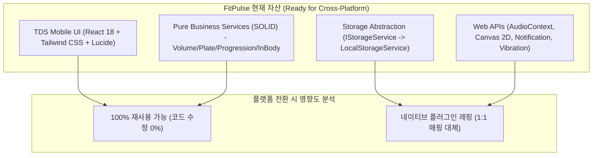
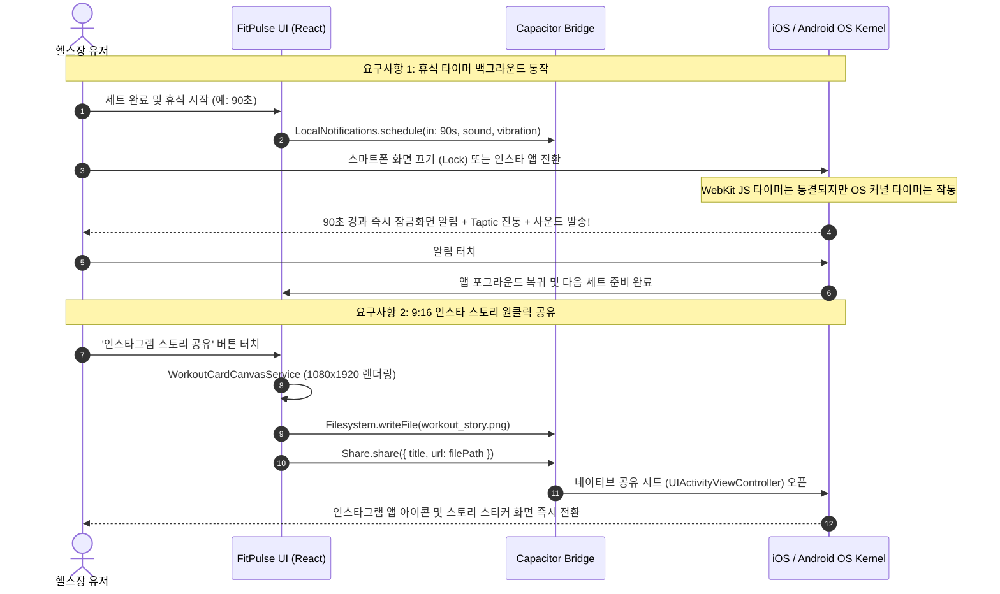
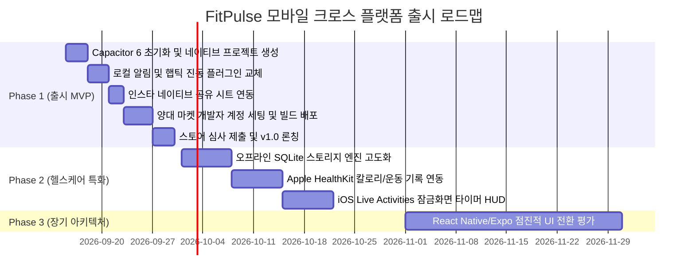

# FitPulse 크로스 플랫폼(iOS / Android) 모바일 기술 전략 보고서

> **작성일자**: 2026-09-10  
> **작성자**: FitPulse 프로덕트 매니저(PM) & 유저 리서치 에이전트 (`product_research_agent`)  
> **버전**: v1.0.0  
> **문서 상태**: Final Approved Architecture Roadmap  

---

## Executive Summary (경영진 및 개발팀 요약)

FitPulse는 현재 **React 18, TypeScript, Vite, Tailwind CSS** 기반의 TDS Mobile(토스 디자인 시스템) 웹 애플리케이션으로 기틀이 완성되어 있으며, 도메인 로직이 SOLID 원칙에 입각한 순수 TypeScript 클래스로 완벽히 격리되어 있습니다.

본 보고서는 **최소한의 리소스(1인 또는 소수 애자일 팀)**로 **Google Play Store와 Apple App Store 양대 마켓에 동시 출시**하고, **헬스장 특화 경험(지하 헬스장 오프라인 영속성, 잠금화면 백그라운드 타이머/진동, 인스타 9:16 네이티브 공유, Apple HealthKit/Samsung Health 연동)**을 달성하기 위한 최적의 기술 전략으로 **[Capacitor 6 기반 네이티브 하이브리드 전략]**을 최종 채택하고 3단계 점진적 실행 로드맵을 제안합니다.

---

## 1. 현재 FitPulse 기술 자산 및 상황 분석

FitPulse의 프론트엔드 아키텍처는 크로스 플랫폼 확장에 있어 압도적인 기술적 우위를 확보하고 있습니다.

### 1.1 핵심 강점
1. **완벽한 클린 아키텍처 및 순수 서비스 분리**:
   - `VolumeService`, `PlateCalculatorService`, `ProgressionRecommendationService`, `InBodyService`, `ExerciseLibraryService`, `RoutineService` 등은 DOM 및 브라우저 API에 의존하지 않는 순수 TypeScript 클래스입니다.
2. **IStorageService 의존성 역전(DIP)**:
   - 데이터 저장이 인터페이스로 추상화되어 있어, 브라우저 LocalStorage에서 네이티브 SQLite / Key-Value 스토리지로 교체할 때 호출부 변경이 불필요합니다.
3. **모바일 퍼스트 TDS(토스 디자인 시스템) 인터페이스**:
   - 뷰포트 너비 430px(iPhone Pro Max 규격)에 최적화된 반응형 UI와 Safe Area 설계, 하단 네비게이션, 모달 및 시트 구조가 이미 네이티브 앱과 동일한 UX를 갖추고 있습니다.

### 1.2 네이티브 전환 시 도전 과제
1. **오디오/타이머 백그라운드 제약**: 모바일 브라우저(특히 iOS Safari WebKit)는 백그라운드 진입 또는 화면 잠금 시 `AudioContext`와 `setInterval`을 강제 정지(Freeze)시킴.
2. **인스타 스토리 공유 흐름**: 현재 웹 환경에서는 파일 다운로드 방식(`<a>` 태그)으로 동작하여 갤러리에 저장 후 수동 업로드해야 하는 UX 마찰 존재.
3. **스토어 심사 리스크**: 단순 웹사이트 래핑(Wrap)은 Apple App Store 가이드라인 4.2(최소 기능 미달)로 리젝될 위험이 있음.

---

## 2. 모바일 크로스 플랫폼 후보군 심층 비교

| 평가 항목 | 1. PWA / TWA | 2. Capacitor 6 (추천 ★★★) | 3. React Native (Expo) | 4. Flutter (Dart) |
|---|---|---|---|---|
| **코드 재사용률** | **99%** | **90 ~ 95%** | 40 ~ 50% (로직만 재사용) | 0 ~ 10% (완전 재작성) |
| **개발 공수 (출시까지)** | **1 ~ 3일** | **1 ~ 2주** | 2 ~ 3개월 (UI 전면 재작성) | 3 ~ 4개월 (Dart 전환) |
| **양대 스토어 심사 통과** | ❌ iOS 불가 (PWA 리젝) ⚠️ Android TWA만 가능 | ✅ **통과 확실** (토스, 당근 방식) | ✅ **완벽 통과** | ✅ **완벽 통과** |
| **백그라운드 타이머/알림** | ❌ 화면 꺼짐 시 동결 | ✅ **OS 로컬 푸시 알림 연동** | ✅ 완벽 지원 | ✅ 완벽 지원 |
| **잠금화면 진동/사운드** | ❌ 불가 (iOS Safari 제한) | ✅ **Haptics + Native Alert** | ✅ 완벽 지원 | ✅ 완벽 지원 |
| **지하 헬스장 오프라인** | ⚠️ 브라우저 캐시 용량 한계 | ✅ **SQLite/IndexedDB 영속화** | ✅ 완벽 지원 | ✅ 완벽 지원 |
| **인스타 스토리 공유** | ❌ 웹 다운로드 링크만 지원 | ✅ **네이티브 Share Sheet 즉시 호출** | ✅ 네이티브 인텐트 공유 | ✅ 네이티브 인텐트 공유 |
| **애플 건강 / 삼성 헬스** | ❌ 절대 불가 (웹 권한 없음) | ✅ **Capacitor HealthKit 플러그인** | ✅ 라이브러리 풍부 | ✅ 플러그인 풍부 |
| **1인 개발 유지보수성** | 상 | **최상 (단일 웹 코드베이스)** | 중 (버전 업그레이드 파편화) | 하 (2개 언어/코드베이스 관리) |

---

## 3. 헬스 앱 특화 요구사항 구현 전략

### 3.1 지하 헬스장 오프라인 영속성 (Offline-First)
- **문제점**: 대다수 헬스장이 지하 1~2층에 위치하여 통신 음영 지역 발생(LTE/5G 수신 불량).
- **해결책**:
  1. Capacitor 앱은 웹 리소스(HTML/JS/CSS/이미지)가 원격 서버가 아닌 **앱 패키지 내부 로컬 번들(`capacitor://localhost`)**에서 0ms로 즉각 로딩됩니다.
  2. 스토리지: `IStorageService`의 구현체로 `@capacitor-community/sqlite` 또는 `IndexedDB(idb-keyval)`를 장착하여 수천 개의 세트 로그 및 운동 루틴을 로컬 디바이스에 완벽히 오프라인 보존.
  3. 온라인 복귀 시 백그라운드 싱크 큐(Sync Queue)를 통해 서버 동기화.

### 3.2 잠금화면 & 백그라운드 타이머 알림
- **문제점**: 세트 종료 후 폰을 주머니에 넣거나 화면을 껐을 때 웹 타이머가 일시정지됨.
- **해결책**:
  - Web Worker나 `setInterval`에 의존하지 않고, **완료 시점의 절대 타임스탬프(`Date.now() + restSeconds * 1000`)**를 계산하여 OS 네이티브 `@capacitor/local-notifications`에 등록.
  - 앱이 백그라운드로 전환되거나 폰이 잠겨도 OS 커널 알림 센터에서 **지정된 사운드와 진동 패턴**으로 정확히 깨워줌.
  - 추가 확장: iOS 16.1+ **Live Activities (실시간 현황)** 플러그인을 결합하여 잠금화면 및 Dynamic Island에서 1초 단위로 줄어드는 타이머 HUD 구현.

### 3.3 인스타 스토리 9:16 네이티브 공유 시트
- **문제점**: 웹에서는 파일 다운로드 알림창이 떠서 유저가 사진첩을 열고 인스타를 켜서 사진을 불러와야 함.
- **해결책**:
  - `WorkoutCardCanvasService`가 생성한 Base64 Data URL을 `@capacitor/filesystem`을 통해 앱 캐시 디렉터리에 `fitpulse_workout.png`로 저장.
  - `@capacitor/share`의 `Share.share({ files: [fileUri] })`를 호출하여 OS 네이티브 공유 시트를 원클릭으로 팝업. 유저가 인스타그램을 바로 선택해 스토리 스티커로 즉시 포스팅 가능.

### 3.4 헬스케어 연동 (Apple HealthKit & Samsung Health)
- **확장 플러그인**: `@capgo/capacitor-health-kit`
- **수집 및 기록 항목**:
  - FitPulse 운동 완료 시: **활동 에너지(Active Energy Burned, kcal)** 및 **근력 운동 세션(Functional Strength Training)** 기록 등록 -> 애플 피트니스 링 자동 완주.
  - 인바디 데이터 양방향 동기화: 애플 건강의 체중, 체지방률, 골격근량 데이터를 FitPulse 인바디 탭으로 원클릭 가져오기.

---

## 4. 1인/소수 애자일 팀 관점의 점진적 3단계 로드맵

### [Phase 1] Capacitor 6 기반 양대 스토어 초고속 론칭 (소요 기간: 1.5 ~ 2주)
- **목표**: 기존 웹 코드를 95% 이상 그대로 활용하여 10월 초 양대 스토어에 동시 출시.
- **주요 실행 과제**:
  1. `@capacitor/core`, `@capacitor/cli`, `@capacitor/ios`, `@capacitor/android` 설치 및 `npx cap add ios`, `npx cap add android` 세팅.
  2. Web Native API -> Capacitor 플러그인 어댑터 레이어 구축:
     - `WebNotificationService` -> `@capacitor/local-notifications` + `@capacitor/haptics`
     - `WorkoutCardCanvasService` -> `@capacitor/share` + `@capacitor/filesystem`
  3. iOS App Store 가이드라인 4.2 대비: 앱 셸 내 오프라인 동작 보장, 네이티브 진동/알림을 부각하여 단독 네이티브 앱으로서의 가치 충족.
  4. TestFlight(iOS) 및 내부 테스트 트랙(Android) 배포 후 심사 신청.

### [Phase 2] 오프라인 엔진 강화 & 헬스케어 네이티브 연동 (소요 기간: 3 ~ 4주)
- **목표**: 헬스 매니아(Heavy Lifter)를 위한 전문 웰니스 기능 탑재.
- **주요 실행 과제**:
  1. `IStorageService`의 SQLite 구현체 개발: 네트워크가 완전히 차단된 지하 헬스장에서도 수년간의 운동 히스토리를 0초 지연으로 쿼리.
  2. Apple HealthKit (`@capgo/capacitor-health-kit`) 연동:
     - 운동 시작/종료 시 Apple Watch 피트니스 세션과 동기화.
     - `VolumeService`의 소모 칼로리 추정치를 애플 건강 활동 에너지에 커밋.
  3. iOS Live Activities / Dynamic Island 연동:
     - 스위프트 위젯 킷(WidgetKit) 브릿지를 통해 잠금화면에서 바로 세트 휴식 타이머 표시.

### [Phase 3] 서비스 규모 확장에 따른 아키텍처 진화 (MAU 10만+ 시점)
- **목표**: 초고성능 인터랙션 및 네이티브 제스처가 필수적인 영역에 대한 고도화.
- **전략**:
  - 이미 도메인 로직이 TypeScript 순수 서비스(`VolumeService`, `PlateCalculatorService` 등)로 100% 분리되어 있으므로, 필요한 경우 **React Native(Expo SDK)**로의 전환 비용이 일반 앱 대비 70% 이상 절감됨.
  - 전면 재작성이 필요하지 않다면 Capacitor 셸 유지 하에 특정 모듈만 네이티브 UI로 오버레이하는 하이브리드 방식으로 비용 최소화.

---

## 5. 결론 및 테크니컬 액션 플랜 요약

1. **최적의 선택**: 1인/소수 개발팀의 리소스 한계를 고려할 때, **Capacitor 6**는 2~3개월의 재작성 비용을 **1~2주로 단축**시키는 가장 압도적인 ROI(투자 대비 효율)를 제공합니다.
2. **핵심 해결책**:
   - **백그라운드 타이머**: OS Local Notification 사전 스케줄링 방식으로 완벽 해결.
   - **인스타 공유**: 1080x1920 Canvas 생성 후 Native Share Sheet로 0.5초 만에 스토리 공유.
   - **지하 헬스장**: Capacitor 로컬 번들링 + SQLite 스토리지로 100% 오프라인 작동.
3. **즉시 실행 권장**:
   - `package.json`에 Capacitor 의존성 추가 및 빌드 파이프라인 검증 착수 권장.
