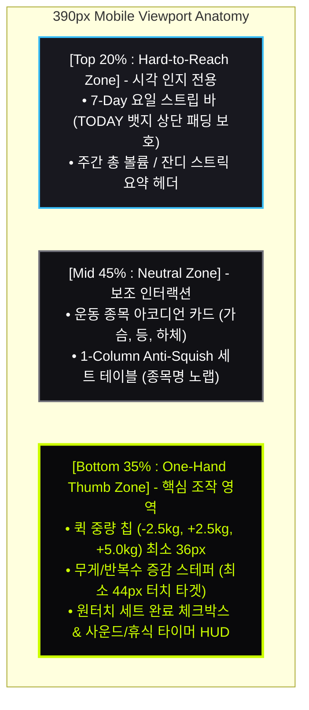
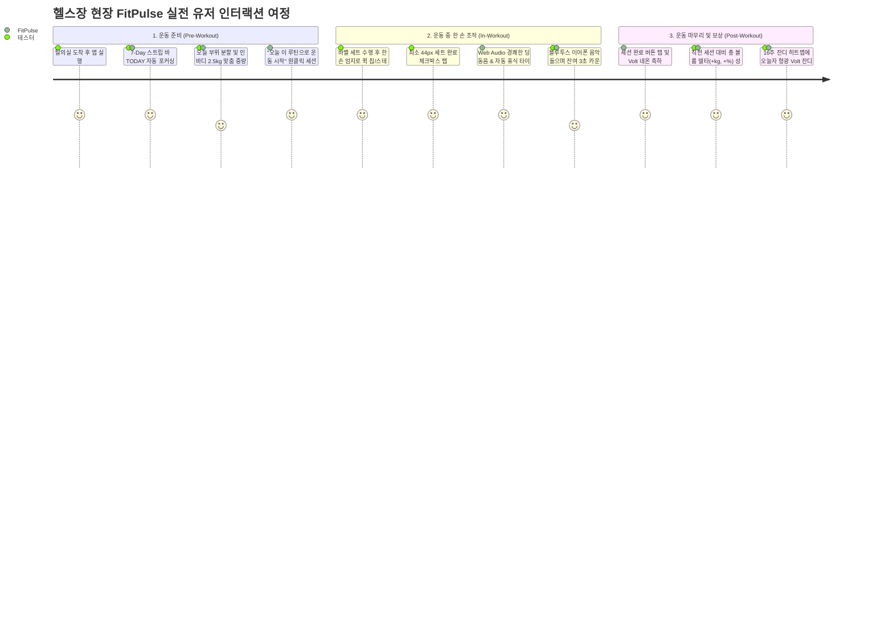
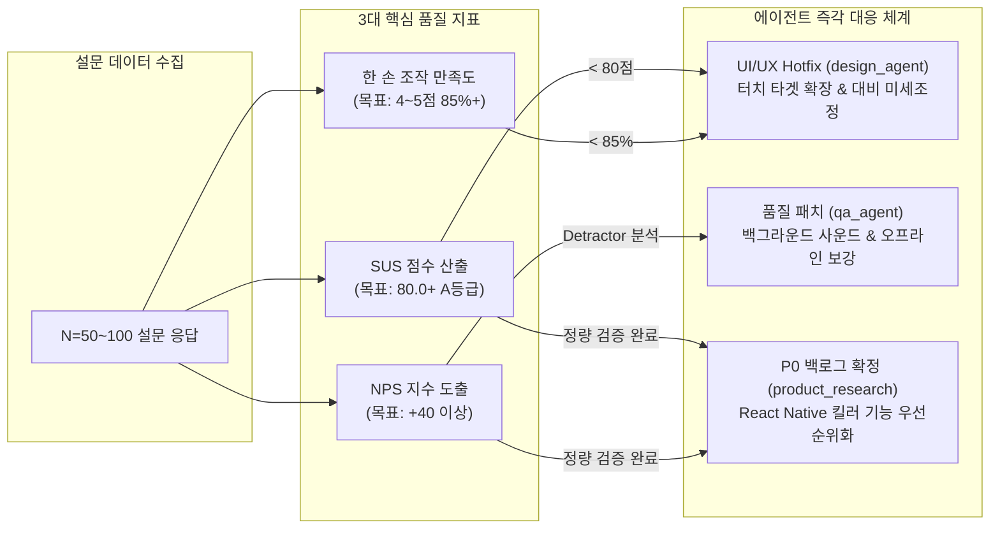

# FitPulse 사용자 경험(UX) 리서치 및 베타테스터 설문조사 명세서

<div align="center">


</div>

> **문서 버전**: v1.2.0 (Design & Research Extended Edition)  
> **작성 일자**: 2026-09-09  
> **공동 기획/감수**:
> - `product_research_agent` (수석 프로덕트 매니저 & 유저 리서처)
> - `design_agent` (수석 UI/UX & 디자인 시스템 아키텍트)
> - `qa_agent` (소프트웨어 아키텍처 & 품질 보증 엔지니어)  
> **대상 플랫폼**: Web & Mobile Web (390px 스마트폰 뷰포트 최적화, 헬스장 한 손 조작 환경)

---

## 🎨 1. UI/UX 디자인 시스템 & 인체공학 가이드라인

FitPulse는 **"땀과 고중량이 교차하는 극한의 헬스장 현장에서 0.5초 만에 인지되고 한 손 엄지로 직관 조작되는 인터페이스"**를 목표로 설계되었습니다. 본 설문조사는 실제 테스터들이 이러한 디자인 철학을 어떻게 체감하는지 검증합니다.

### 1.1 팬톤® 2288 C Volt 고대비 컬러 매트릭스 (WCAG 2.1 AAA)

헬스장의 딤(Dim) 조명, 클럽형 네온 조명, 그리고 고중량 세트 직후의 일시적 시야 왜곡(Tunnel Vision) 상태에서도 완벽한 시인성을 확보하기 위해 엄격한 색상 대비율을 적용했습니다.

| 테마 구분 | 주요 토큰 명칭 | 색상 헥스코드 (HEX) | 배경 대비율 (Contrast) | WCAG 기준 | 디자인 의도 및 기능 |
|:---|:---|:---:|:---:|:---:|:---|
| **다크 모드** | `Obsidian True Carbon` | `#09090B` / `#111115` | Baseline (배경) | - | OLED 픽셀 소등으로 배터리 절감 및 암실 환경 눈부심 차단 |
| **다크 모드** | `Pantone 2288 C Volt` | `#CCFF00` (`#D4FF00`) | **18.2 : 1** | **AAA 만족** | 주요 액션 버튼(CTA), 세트 완료 인디케이터, 활성 탭 |
| **다크 모드** | `Sub Accent Cyan` | `#38BDF8` (Sky 400) | **11.4 : 1** | **AAA 만족** | 총 볼륨 수치, 세트 수치, 정보성 메트릭 |
| **다크 모드** | `Deload Warning Crimson` | `#FF334B` (Red 500) | **6.5 : 1** | **AA 만족** | 디로드 주간 경고, 과부하 실패 경고, 세트 삭제 |
| **라이트 모드** | `Sport Crisp Clean White` | `#FFFFFF` / `#F8FAFC` | Baseline (배경) | - | 주간 채광 및 야외 운동 시 선명한 배경 |
| **라이트 모드** | `Deep Volt Lime` | `#3F6212` (`#4D7C0F`) | **7.4 : 1** | **AAA 만족** | 흰 배경에서 Volt 저대비(1.2:1) 문제를 극복한 고대비 라임 |
| **라이트 모드** | `Deep Carbon Slate` | `#0F172A` (Slate 900) | **16.1 : 1** | **AAA 만족** | 종목명, 반복수 텍스트, 카드 타이틀 |

> [!NOTE]
> **라이트 모드 배지 원칙**: 흰색 배경에서 형광 Volt 단독 텍스트 표기는 시인성이 급격히 떨어지므로, **"형광 Volt 배경 뱃지 + 블랙 텍스트(`text-black bg-[#CCFF00]`)"** 또는 **"Deep Volt Lime(`text-[#3F6212]`)"**만을 엄격히 허용합니다.

---

### 1.2 390px 스마트폰 인체공학적 엄지 영역(Thumb Zone) 아키텍처

한 손으로 덤벨이나 스트랩을 쥐고 다른 한 손으로만 스마트폰을 조작하는 리프터의 파지 습관(Fitts's Law)을 분석하여 화면 영역을 3단계로 분할 배치했습니다.



### 1.3 Anti-Squish & 타이포그래피 황금 비율 규격

1. **텍스트 수직 쪼개짐 방지 (`Anti-Squish`)**:
   - 모바일 390px 뷰포트에서 종목명(예: `인클라인 덤벨 프레스`)이 세로로 쪼개지는 현상을 방지하기 위해 전 세트 카드에 `whitespace-nowrap` 및 1열 스택 레이아웃 강제.
2. **수치 & 단위 가독 비율 (`Typography Hierarchy`)**:
   - 중량과 횟수 수치는 시각적 왜곡이 없는 모노스페이스 폰트(`JetBrains Mono`)를 적용.
   - 수치와 단위(`kg`, `회`)는 `flex items-baseline` 정렬하며, 단위 크기는 수치의 **55% 축소 비율**을 유지하여 숫자에 즉각적인 시선 집중 유도.
3. **최소 44px 터치 타겟 (Finger-Friendly Touch Target)**:
   - 땀으로 미끄럽거나 헬스 장갑을 착용한 상태에서도 터치 오차가 발생하지 않도록 모든 액티브 버튼과 체크 영역에 최소 44×44px의 히트박스 보장.

---

## 💬 2. 에이전트 다자간 디스커션: Design, QA, Product 심층 피드백

### 2.1 `design_agent` (UI/UX 디자인 시스템) 코멘트
- **Volt 테마 평가**: `#CCFF00`의 18.2:1 대비율은 타사 피트니스 앱 대비 압도적인 집중도를 제공합니다. 특히 다크 테마에서 액티브 요소가 한눈에 분리되는 점은 고중량 세트 후 피로도가 극에 달했을 때 최고의 인지 효율을 냅니다.
- **설문 관점 제안**:
  1. 실제 헬스장의 강한 다운라이트(천장 스포트라이트) 조명 하에서 반사광(Glare)이 발생할 때의 다크/라이트 모드 전환 만족도를 별도 문항으로 신설해야 합니다.
  2. 헬스 장갑이나 스트랩 착용 시 퀵 칩(-2.5kg, +2.5kg)과 스테퍼의 터치 빗나감 빈도를 정밀 측정해야 합니다.

### 2.2 `qa_agent` (소프트웨어 아키텍처 & 안정성) 코멘트
- **오프라인 영속성 평가**: 지하 헬스장의 LTE/5G 음영 구역에서도 `LocalStorageService` 기반 온디바이스 영속화로 세션 데이터가 100% 보존되는 점은 QA 테스트에서 최고 수준의 안정성을 기록했습니다.
- **설문 관점 제안**:
  1. 테스터가 운동 중간에 전화를 받거나 인스타그램/음악 스트리밍 앱을 오갈 때 브라우저 백그라운드 킬(Kill) 상황에서의 복원 경험을 반드시 검증해야 합니다.
  2. 무외부 의존성 Web Audio API 비프음이 블루투스 이어폰 음악 재생 환경에서 음원 덕킹(Ducking)이나 씹힘 없이 정상 전달되는지 체감 질문을 배치해야 합니다.

### 2.3 `product_research_agent` (프로덕트 매니지먼트) 코멘트
- **사용자 심리 및 여정 평가**: 단순 기록 앱을 넘어 "오늘 무슨 운동을 해야 하는가(7-Day 분할)"와 "지난번보다 더 들었는가(볼륨 델타)"를 직관적으로 제시함으로써 점진적 과부하 원칙을 자연스럽게 유도하고 있습니다.
- **설문 반영 전략**:
  1. SUS 10문항을 표준 규격대로 배치하여 객관적 사용성 벤치마크 점수(목표: 80점 이상)를 산출합니다.
  2. NPS 11점 척도를 통해 비추천자(Detractor)와 적극 추천자(Promoter)의 정성적 원인을 규명합니다.

---

## 🗺️ 3. FitPulse 헬스장 엔드투엔드 유저 여정 (User Journey)



---

## 📋 4. FitPulse 모바일 웹 베타테스터 사용자 설문조사 명세서

### 4.1 설문 개요 요약

| 항목 | 내용 |
|:---|:---|
| **조사 명칭** | FitPulse 모바일 웹 베타테스터 사용성 및 UX 만족도 조사 (v1.2) |
| **조사 대상** | 주 2회 이상 웨이트 트레이닝을 수행하며 스마트폰으로 운동을 기록하는 헬스인 (N = 50~100명) |
| **설문 환경** | 실제 헬스장 운동 전/중/후 모바일 웹(390px 뷰포트 기준) 직접 조작 |
| **소요 시간** | 약 4분 내외 |
| **핵심 목적** | 1. 헬스장 한 손 조작성 및 44px 터치 타겟 적합도 평가<br/>2. 팬톤 2288 C Volt 고대비 테마 시인성 검증<br/>3. 오프라인 데이터 안정성 및 Web Audio 반응성 체감 측정<br/>4. 표준 SUS 점수(목표 80+) 및 NPS 추천지수 도출 |

---

### [섹션 1] 응답자 기본 정보 및 운동 페르소나 (User Persona)

> [!NOTE]
> 응답자의 운동 숙련도와 평소 기록 습관을 파악하여 그룹별(초급자 vs 헤비 리프터) 데이터 분석의 가중치를 설정합니다.

#### Q1. 평소 웨이트 트레이닝(헬스) 경력은 어떻게 되시나요?
> 🏷️ **분류**: 기본 인구통계 ｜ 📌 **유형**: 객관식 (단일 선택) ｜ ⏱️ **응답**: 필수

- [ ] ① 6개월 미만 (헬스 입문 / 초보자)
- [ ] ② 6개월 이상 ~ 2년 미만 (초중급자)
- [ ] ③ 2년 이상 ~ 5년 미만 (중급 리프터)
- [ ] ④ 5년 이상 (상급자 / 전문 리프터)

#### Q2. 일주일에 평균 몇 회 헬스장에 방문하여 운동하시나요?
> 🏷️ **분류**: 훈련 빈도 ｜ 📌 **유형**: 객관식 (단일 선택) ｜ ⏱️ **응답**: 필수

- [ ] ① 주 1 ~ 2회
- [ ] ② 주 3 ~ 4회
- [ ] ③ 주 5 ~ 6회
- [ ] ④ 주 7회 (매일 운동)

#### Q3. 현재 주로 진행하시는 훈련 분할 방식은 무엇인가요?
> 🏷️ **분류**: 훈련 루틴 ｜ 📌 **유형**: 객관식 (단일 선택) ｜ ⏱️ **응답**: 필수

- [ ] ① 무분할 (전신 루틴 Full-Body)
- [ ] ② 2분할 (상체 / 하체 or 푸시 / 풀)
- [ ] ③ 3분할 (가슴·삼두 / 등·이두 / 하체·어깨 등)
- [ ] ④ 4분할 이상 (세분화된 타겟 분할)
- [ ] ⑤ 정해진 분할 없이 당일 기구 상황에 따라 즉흥 운동

#### Q4. FitPulse를 사용하기 전, 운동 기록을 주로 어떤 방식으로 관리하셨나요?
> 🏷️ **분류**: 기존 솔루션 ｜ 📌 **유형**: 객관식 (복수 선택 가능) ｜ ⏱️ **응답**: 필수

- [ ] 머릿속으로만 기억하고 별도 기록하지 않음
- [ ] 스마트폰 기본 메모장 (iOS 메모, 삼성 노트, Notion 등)
- [ ] 기존 피트니스 앱 (번핏, 플렉, 헤비, 스트롱 등)
- [ ] 아날로그 종이 운동 일지 / 수첩
- [ ] 피트니스 스마트워치 기본 기록 기능만 사용

---

### [섹션 2] 운동 중 현장 조작성 & UI/UX 인체공학 (In-Gym Ergonomics)

> [!IMPORTANT]
> **헬스장 현장 환경(땀, 장갑 착용, 거친 호흡, 덤벨을 든 채 한 손 조작)**에서의 실제 체감을 기준으로 응답해 주시기 바랍니다.

#### Q5. 390px 스마트폰 화면에서 한 손 엄지손가락으로 퀵 중량 칩(`-2.5kg`, `+2.5kg`, `+5kg`)과 증감 스테퍼를 조작하기 편리했습니까?
> 🏷️ **분류**: 엄지 영역(Thumb Zone) 조작성 ｜ 📌 **유형**: 5점 리커트 척도 ｜ ⏱️ **응답**: 필수

| 척도 점수 | 1점 | 2점 | 3점 | 4점 | 5점 |
|:---:|:---:|:---:|:---:|:---:|:---:|
| **기준** | 매우 불편 (터치 불가 수준) | 다소 불편 (터치 미스 잦음) | 보통 (사용 가능) | 편리함 (한 손 조작 원활) | 매우 편리함 (완벽한 엄지 영역) |
| **선택** | [ ] | [ ] | [ ] | [ ] | [ ] |

- *(선택 서술)* 터치가 빗나가거나 손이 잘 닿지 않았던 위치가 있다면 구체적으로 적어주세요:
  `[                                                                       ]`

#### Q6. 세트 완료 체크박스 및 인터랙션 버튼(최소 44×44px 터치 영역)의 반응성과 터치 정확도는 어떠했습니까?
> 🏷️ **분류**: 터치 타겟 인체공학 ｜ 📌 **유형**: 5점 리커트 척도 ｜ ⏱️ **응답**: 필수

- [ ] ① 전혀 만족스럽지 않다 (버튼이 작아 여러 번 탭해야 했음)
- [ ] ② 다소 아쉽다 (땀이나 장갑 착용 시 간헐적 미스 발생)
- [ ] ③ 보통이다 (일반적인 조작 수준)
- [ ] ④ 만족스럽다 (한 번에 정확하게 탭됨)
- [ ] ⑤ 매우 만족스럽다 (장갑을 끼거나 손에 땀이 있어도 즉각 반응함)

#### Q7. 헬스장의 어두운 조명(OLED 다크모드) 환경에서 'Pantone 2288 C 형광 볼트' 컬러의 가독성과 시인성은 어떠했습니까?
> 🏷️ **분류**: 디자인 시스템 시인성 ｜ 📌 **유형**: 5점 리커트 척도 ｜ ⏱️ **응답**: 필수

- [ ] ① 눈이 부시거나 피로했다 (명도/채도가 과함)
- [ ] ② 다소 시인성이 떨어졌다
- [ ] ③ 보통이다 (무난한 수준)
- [ ] ④ 중요한 수치와 액션이 한눈에 들어와 쾌적했다
- [ ] ⑤ 지금까지 써본 피트니스 앱 중 시인성이 가장 압도적이었다 (터널 비전 상태에서도 즉각 식별)

#### Q8. 천장 스포트라이트 반사광(Glare)이 있는 환경이나 주간 운동 시, 라이트 모드(Sport Crisp White)의 가독성은 어떠했습니까?
> 🏷️ **분류**: 라이트 테마 가독성 ｜ 📌 **유형**: 객관식 (단일 선택) ｜ ⏱️ **응답**: 필수

- [ ] ① 흰 배경에 볼트 요소가 묻혀 잘 보이지 않았다
- [ ] ② 다소 눈이 부셨다
- [ ] ③ Deep Volt Lime과 Slate 텍스트의 대비가 좋아 야외/채광 아래서도 매우 선명했다
- [ ] ④ 다크 모드만 사용하여 라이트 모드는 체험하지 못했다

#### Q9. 종목명 텍스트 줄바꿈 방지(`whitespace-nowrap`)와 1열 전용 카드 레이아웃은 운동 중 내용 파악에 도움이 되었습니까?
> 🏷️ **분류**: 모바일 Anti-Squish ｜ 📌 **유형**: 5점 리커트 척도 ｜ ⏱️ **응답**: 필수

- [ ] ① 전혀 도움 되지 않았다 (화면 밖으로 글자가 잘림)
- [ ] ② 글자가 한눈에 들어오지 않았다
- [ ] ③ 보통이다
- [ ] ④ 종목명과 무게/반복수가 줄바꿈 없이 깔끔하게 정렬되어 즉시 파악되었다
- [ ] ⑤ 가독성이 극대화되어 운동 템포가 끊기지 않았다

#### Q10. 세트 완료 체크 시 작동하는 Web Audio 신디사이징 사운드와 자동 휴식 타이머(90초/120초)는 어떠셨나요?
> 🏷️ **분류**: 피드백 & 타이머 ｜ 📌 **유형**: 객관식 (단일 선택) ｜ ⏱️ **응답**: 필수

- [ ] ① 소리/타이머가 불필요하거나 운동 흐름을 방해했다
- [ ] ② 타이머는 유용했으나 사운드는 거슬렸다
- [ ] ③ 보통이다
- [ ] ④ 세트 완료 피드백과 휴식 시간 통제에 큰 도움이 되었다
- [ ] ⑤ 종료 3초 전 카운트다운 비프음 덕분에 다음 세트 준비 집중도가 극대화되었다

#### Q11. 블루투스 이어폰으로 음악을 듣고 있거나 헬스장 소음 속에서 휴식 타이머 종료음이 적절히 인지되었습니까?
> 🏷️ **분류**: 오디오 인지성 ｜ 📌 **유형**: 객관식 (단일 선택) ｜ ⏱️ **응답**: 필수

- [ ] ① 전혀 들리지 않았다 (추가 스마트폰 진동 및 화면 플래시 알림 필수)
- [ ] ② 음악 소리에 묻혀 가끔 놓쳤다
- [ ] ③ 음악 재생 중에도 적당한 크기로 뚜렷하게 인지되었다
- [ ] ④ 이어폰 없이 스마트폰 스피커 상태로도 충분히 식별되었다
- [ ] ⑤ 항상 무음 모드로 운동하여 오디오를 체감하지 못했다

#### Q12. 지하 헬스장(통신 불량 구역)이나 운동 도중 다른 앱(음악, 카메라)을 사용 후 돌아왔을 때 데이터가 안전하게 유지되었습니까?
> 🏷️ **분류**: 오프라인 신뢰성 ｜ 📌 **유형**: 객관식 (단일 선택) ｜ ⏱️ **응답**: 필수

- [ ] ① 데이터가 유실되거나 세션이 초기화된 적이 있다 *(구체적 상황 아래 기입 요망)*
- [ ] ② 화면 복구 시 멈칫거림이나 딜레이가 있어 불안했다
- [ ] ③ 네트워크가 끊겨도 세트 기록과 타이머가 매끄럽게 유지되었다
- [ ] ④ 완벽하게 신뢰할 수 있을 정도로 안정적이었다

---

### [섹션 3] 루틴 플래너 & 점진적 과부하 동기부여 (Growth & Motivation)

> [!TIP]
> FitPulse의 핵심 가치인 **"점진적 과부하(Progressive Overload)의 시각화"**가 유저에게 실질적인 성취감을 주는지 측정합니다.

#### Q13. 상단 '7-Day 요일 스트립 바'에서 오늘 요일(TODAY)을 자동 감지하고 원클릭으로 세션을 여는 동선은 직관적이었습니까?
> 🏷️ **분류**: 루틴 진입 동선 ｜ 📌 **유형**: 5점 리커트 척도 ｜ ⏱️ **응답**: 필수

- [ ] ① 매우 복잡하고 헷갈렸다
- [ ] ② 다소 탐색이 필요했다
- [ ] ③ 보통이다
- [ ] ④ 직관적이며 오늘 해야 할 분할 루틴을 바로 시작할 수 있었다
- [ ] ⑤ 헬스장 입장 후 첫 세트 시작까지 걸리는 시간이 획기적으로 단축되었다

#### Q14. 운동 완료 후 표시되는 '직전 세션 대비 총 볼륨 증감 델타(+kg, +%)'는 다음 운동에 자극이 되었습니까?
> 🏷️ **분류**: 점진적 과부하 델타 ｜ 📌 **유형**: 5점 리커트 척도 ｜ ⏱️ **응답**: 필수

- [ ] ① 전혀 도움 되지 않았다
- [ ] ② 별다른 감흥이 없었다
- [ ] ③ 보통이다
- [ ] ④ 지난번보다 무게나 횟수를 더 채웠는지 즉시 확인되어 성취감이 컸다
- [ ] ⑤ 다음 세션에서 무조건 +볼륨을 달성하고 싶게 만드는 강력한 동기부여가 되었다

#### Q15. 개발자 GitHub 잔디를 오마주한 '16주 잔디 히트맵'은 출석 동기부여에 긍정적인 영향을 주었습니까?
> 🏷️ **분류**: 게이미피케이션 스트릭 ｜ 📌 **유형**: 5점 리커트 척도 ｜ ⏱️ **응답**: 필수

- [ ] ① 전혀 관심 없다
- [ ] ② 별다른 효과가 없다
- [ ] ③ 보통이다
- [ ] ④ 형광 Volt 잔디가 채워지는 시각적 재미가 쏠쏠하다
- [ ] ⑤ 연속 출석(Streak)의 끊김을 막기 위해 헬스장에 가고 싶어질 정도로 강력하다

#### Q16. 체성분 기반 '인바디 맞춤 2.5kg 단위 추천 중량'의 실전 정확도와 편의성은 어떠했습니까?
> 🏷️ **분류**: 알고리즘 실전성 ｜ 📌 **유형**: 객관식 (단일 선택) ｜ ⏱️ **응답**: 필수

- [ ] ① 실제 수행 능력과 너무 동떨어져 있었다 (너무 무겁거나 너무 가벼움)
- [ ] ② 다소 괴리가 있어 직접 전면 수정해야 했다
- [ ] ③ 실제 본세트 중량과 대체로 비슷했다 (오차 ±5%~10% 수준)
- [ ] ④ 상용 바벨 원판(2.5kg) 규격에 딱 맞아 머릿속 원판 계산 없이 바로 세팅할 수 있어 매우 편리했다
- [ ] ⑤ 인바디 수치를 입력하지 않아 경험해보지 못했다

---

### [섹션 4] 국제 표준 시스템 사용성 척도 (SUS: System Usability Scale)

> [!NOTE]
> 국제 표준 ISO 9241-11 기반의 시스템 사용성 척도(SUS)입니다. 각 문항에 대해 빠르고 솔직하게 1(전혀 동의하지 않음)부터 5(매우 동의함)까지 체크해주세요.

| 문항 코드 | 설문 평가 문항 | 1 (전혀 아님) | 2 (다소 아님) | 3 (보통) | 4 (동의함) | 5 (매우 동의) |
|:---:|:---|:---:|:---:|:---:|:---:|:---:|
| **SUS-01** | 나는 FitPulse를 앞으로 일상 운동에서 정기적으로 사용하고 싶다. | [ ] | [ ] | [ ] | [ ] | [ ] |
| **SUS-02** | 나는 FitPulse의 시스템이 불필요하게 복잡하다고 느꼈다. *(역코딩)* | [ ] | [ ] | [ ] | [ ] | [ ] |
| **SUS-03** | 나는 FitPulse가 별도의 설명서 없이도 사용하기 매우 쉽다고 생각했다. | [ ] | [ ] | [ ] | [ ] | [ ] |
| **SUS-04** | 나는 이 시스템을 원활하게 쓰기 위해 전문가의 기술적 지원이 필요할 것 같다. *(역코딩)* | [ ] | [ ] | [ ] | [ ] | [ ] |
| **SUS-05** | 나는 FitPulse의 다양한 기능(루틴, 타이머, 인바디, 잔디)들이 매우 유기적으로 잘 통합되어 있다고 느꼈다. | [ ] | [ ] | [ ] | [ ] | [ ] |
| **SUS-06** | 나는 이 시스템에 모순되거나 일관성이 부족한 인터랙션이 너무 많다고 느꼈다. *(역코딩)* | [ ] | [ ] | [ ] | [ ] | [ ] |
| **SUS-07** | 나는 대부분의 헬스인들이 이 시스템의 사용법을 아주 빠르게 배울 수 있을 것이라 생각한다. | [ ] | [ ] | [ ] | [ ] | [ ] |
| **SUS-08** | 나는 헬스장에서 이 시스템을 조작하는 것이 성가시고 번거롭다고 느꼈다. *(역코딩)* | [ ] | [ ] | [ ] | [ ] | [ ] |
| **SUS-09** | 나는 운동 세트를 기록하고 타이머를 운용하는 데 있어 매우 높은 조작 자신감을 느꼈다. | [ ] | [ ] | [ ] | [ ] | [ ] |
| **SUS-10** | 나는 이 시스템을 제대로 사용하기 전에 많은 사전 지식을 학습해야만 했다. *(역코딩)* | [ ] | [ ] | [ ] | [ ] | [ ] |

> [!TIP]
> **SUS 점수 환산 공식**:
> - 홀수 문항(긍정): `점수 - 1` 의 합산
> - 짝수 문항(부정/역코딩): `5 - 점수` 의 합산
> - **최종 SUS Score** = `(홀수 합 + 짝수 합) × 2.5` (100점 만점)
> - *등급 기준*: 68점 이상 (Average/OK), 80점 이상 (A등급 / Excellent), 90점 이상 (Best-in-Class)

---

### [섹션 5] 순추천고객지수(NPS) 및 심층 정성 인터뷰 (Qualitative Insights)

#### Q17. FitPulse를 주변의 동료 헬스인, 운동 파트너, 친구에게 추천할 의향이 얼마나 있으십니까?
> 🏷️ **분류**: 순추천고객지수 (NPS) ｜ 📌 **유형**: 0~10점 단일 척도 ｜ ⏱️ **응답**: 필수

```
[ 0 ]   [ 1 ]   [ 2 ]   [ 3 ]   [ 4 ]   [ 5 ]   [ 6 ]   ｜   [ 7 ]   [ 8 ]   ｜   [ 9 ]   [ 10 ]
◀─────────── 🔴 비추천 고객 (Detractor) ───────────▶   ◀─ 🟡 수동 중립자 ─▶   ◀ 🟢 적극 추천 (Promoter) ▶
```

- **선택 체크**:
  - 🔴 **비추천 그룹**: [ ] 0점 ｜ [ ] 1점 ｜ [ ] 2점 ｜ [ ] 3점 ｜ [ ] 4점 ｜ [ ] 5점 ｜ [ ] 6점
  - 🟡 **중립 그룹**: [ ] 7점 ｜ [ ] 8점
  - 🟢 **적극 추천 그룹**: [ ] 9점 ｜ [ ] 10점

#### Q18. 위 추천(또는 비추천) 점수를 부여하신 가장 결정적인 이유는 무엇인가요?
> 🏷️ **분류**: 추천 근거 서술 ｜ 📌 **유형**: 주관식 서술 ｜ ⏱️ **응답**: 필수

```text
답변: [                                                                                                   ]
```

#### Q19. FitPulse를 사용하시면서 가장 만족스러웠던 '킬러 기능'이나 '디자인 요소'는 무엇이었습니까?
> 🏷️ **분류**: 강점 발견 ｜ 📌 **유형**: 주관식 서술 ｜ ⏱️ **응답**: 선택

```text
답변: [                                                                                                   ]
```

#### Q20. 실제 헬스장 현장에서 조작할 때 가장 불편했거나 개선이 시급하다고 느낀 점은 무엇인가요?
> 🏷️ **분류**: 페인 포인트 발굴 ｜ 📌 **유형**: 주관식 서술 (버그, 터치 미스, 문구 어색함 등) ｜ ⏱️ **응답**: 필수

```text
답변: [                                                                                                   ]
```

#### Q21. 향후 정식 모바일 앱(React Native) 출시 시 가장 먼저 탑재되기를 희망하는 기능은 무엇인가요?
> 🏷️ **분류**: 차기 스프린트 로드맵 ｜ 📌 **유형**: 우선순위 복수 선택 ｜ ⏱️ **응답**: 필수

- [ ] **애플워치 / 갤럭시워치 실시간 동기화** (손목에서 즉시 세트 완료 및 심박수 연동)
- [ ] **백그라운드 다이내믹 아일랜드 & 라이브 액티비티** (화면이 잠겨도 잔여 휴식 시간 표시)
- [ ] **RPE(운동자각도) / RIR(예비반복수) 정밀 기록** (파워리프팅/보디빌딩 전문 피로도 추적)
- [ ] **소셜 크루 & 볼륨 랭킹 대결** (친구와 주간 총 볼륨 및 잔디 히트맵 실시간 경쟁)
- [ ] **바벨 궤적(Bar Path) AI 영상 분석 및 1RM 갱신 축하 연출**
- [ ] 기타 희망 기능: `[                                                               ]`

---

## 📊 5. 리서치 분석 지표 및 프로덕트 액션 플랜



1. **정량 KPI 임계치 및 트리거**:
   - **SUS 점수 80점 미만 시**: `design_agent` 주도로 터치 빗나감 영역(Q5) 및 복잡도(SUS-02) 피드백에 대한 화면 레이아웃 리팩토링 즉시 착수.
   - **NPS +40 미만 시**: Detractor(0~6점)의 Q18 주관식 사유를 클러스터링하여 치명적 장애 요인(P0) 추출.
2. **현장 환경 피드백 반영**:
   - 땀/장갑 착용 시 터치 불편(Q6) 응답이 15%를 초과할 경우, 퀵 칩 버튼 높이를 36px에서 44px로 상향 조정하고 햅틱 진동 피드백 추가.
   - 블루투스 음악 청취 시 오디오 미인지(Q11)가 발생할 경우 Web Audio 주파수 대역(D5-A5) 상향 및 Web Notification 화면 플래시 기능 추가.
3. **정식 모바일 앱 로드맵 파이프라인**:
   - Q21 1위 득표 기능을 차기 React Native 전환 프로젝트의 P0 마일스톤으로 즉시 승격.

---
*FitPulse Multi-Agent Autonomous Engineering Team*  
*`product_research_agent` · `design_agent` · `qa_agent`*
