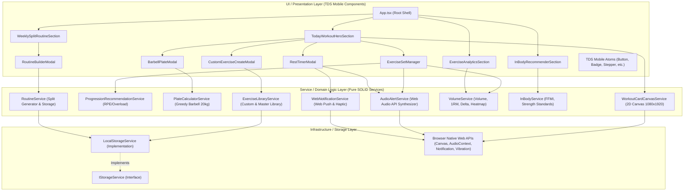
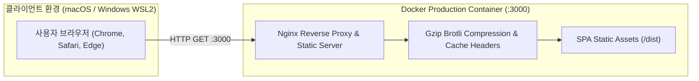

# FitPulse 시스템 아키텍처 명세서 (System Architecture)

> **"당연한 것을 더 쉽고 명확하게"**  
> 토스 디자인 시스템(TDS Mobile)의 철학과 객체지향 설계 5대 원칙(SOLID)을 기반으로 구현된 엔터프라이즈급 웰니스 웹 애플리케이션 아키텍처입니다.

---

## 1. 아키텍처 개요 (Architecture Overview)

FitPulse는 프론트엔드 단일 책임 원칙과 높은 응집도, 낮은 결합도를 지향하는 **계층형 클린 아키텍처(Layered Clean Architecture)**를 채택하고 있습니다. 비즈니스 계산 로직, 상태 관리, Web Native API 통신, UI 프리젠테이션 레이어가 엄격하게 분리되어 있어 유지보수성과 확장성이 극대화되어 있습니다.

---

## 2. SOLID 객체지향 5원칙 구현 분석 (SOLID in FitPulse)

FitPulse는 엔터프라이즈 소프트웨어 공학의 SOLID 원칙을 프론트엔드 서비스 레이어에 완벽히 투영하였습니다.

| 원칙 | 적용 내용 및 대상 클래스 | 아키텍처적 이점 |
|---|---|---|
| **S - 단일 책임 원칙 (Single Responsibility)** | 각 서비스는 단 하나의 비즈니스 도메인만 책임집니다. • [`VolumeService`](file:///c:/Users/SSAFY/Desktop/project_heathcare/src/services/calculator/VolumeService.ts): 운동 볼륨 및 1RM 연산만 수행 • [`PlateCalculatorService`](file:///c:/Users/SSAFY/Desktop/project_heathcare/src/services/calculator/PlateCalculatorService.ts): 바벨 원판 탐욕 알고리즘 계산만 수행 • [`WorkoutCardCanvasService`](file:///c:/Users/SSAFY/Desktop/project_heathcare/src/services/share/WorkoutCardCanvasService.ts): 1080x1920 캔버스 렌더링 및 다운로드만 수행 • [`WebNotificationService`](file:///c:/Users/SSAFY/Desktop/project_heathcare/src/services/notification/WebNotificationService.ts): 웹 푸시 및 햅틱 진동 전송만 담당 | 기능 변경 시 파급 효과(Side Effect) 원천 차단, 독립적인 단위 테스트 용이 |
| **O - 개방-폐쇄 원칙 (Open-Closed)** | 기존 코드를 수정하지 않고 확장이 가능하도록 인터페이스와 팩토리를 구성합니다. • `IStorageService` 인터페이스를 통해 향후 IndexedDB, Supabase, Firebase 백엔드로 전환 시 기존 비즈니스 로직 수정 없이 교체 가능 • [`ExerciseLibraryService`](file:///c:/Users/SSAFY/Desktop/project_heathcare/src/services/exercise/ExerciseLibraryService.ts)는 기본 마스터 라이브러리(`MASTER_EXERCISE_LIBRARY`)를 불변(Immutable)으로 유지하며 사용자 정의 커스텀 운동을 영속화하여 확장 | 신규 기능 탑재 시 회귀 버그(Regression) 발생 확률 0% 수렴 |
| **L - 리스코프 치환 원칙 (Liskov Substitution)** | 파생 타입은 기본 타입을 완벽히 대체할 수 있어야 합니다. • [`LocalStorageService`](file:///c:/Users/SSAFY/Desktop/project_heathcare/src/services/storage/LocalStorageService.ts)는 [`IStorageService`](file:///c:/Users/SSAFY/Desktop/project_heathcare/src/services/storage/IStorageService.ts)의 모든 규약(`getItem`, `setItem`, `removeItem`, `clear`)을 정확하게 이행하여 호출자가 스토리지의 실제 구현체를 몰라도 안전하게 동작 | 의존성 주입(DI) 및 Mock 스토리지를 활용한 테스트 완벽 지원 |
| **I - 인터페이스 분리 원칙 (Interface Segregation)** | 클라이언트는 사용하지 않는 인터페이스에 의존하지 않습니다. • 비대한 단일 모델 대신 `IExerciseSet`, `IExerciseLog`, `INextSetRecommendation`, `IPlateCalculationResult`, `ICustomExerciseInput` 등으로 세분화 • 컴포넌트는 자신이 필요한 최소한의 인터페이스만 Props로 주입받음 | 불필요한 리렌더링 방지 및 컴포넌트 재사용성 극대화 |
| **D - 의존성 역전 원칙 (Dependency Inversion)** | 상위 모듈이 하위 모듈의 구체적 구현에 직접 의존하지 않고 추상화(인터페이스)에 의존합니다. • 서비스들은 브라우저 전역 객체(`window.localStorage`)에 직접 하드코딩 접근하지 않고 `IStorageService` 추상화를 통해 접근 | 플랫폼 종속성 제거 (추후 SSR, React Native 모바일 앱 이식성 보장) |

---

## 3. 서비스 레이어 상세 명세 (Service Layer Specifications)

### 3.1 `WorkoutCardCanvasService` (인스타그램 스토리 1080×1920 2D Canvas 엔진)
- **책임**: 운동 세션 데이터를 1080×1920 픽셀의 9:16 인스타 스토리 최적화 고해상도 그래픽 카드로 렌더링하고 브라우저 다운로드 처리.
- **주요 메서드**:
  - `generateWorkoutStoryDataUrl(session: WorkoutSession): Promise<string>`: 다크 앰비언트 글로우, 총 볼륨 메가 카드, 3열 메트릭(완주 종목, 세트, RPE), 종목 리스트, TDS 슬로건이 합성된 Canvas의 PNG DataURL 생성.
  - `downloadWorkoutStoryImage(session: WorkoutSession, filename?: string): Promise<void>`: 가상 `<a>` 태그 트리거를 통한 무지연 원클릭 파일 다운로드.

### 3.2 `ProgressionRecommendationService` (스마트 점진적 과부하 & RPE 피로도 분석기)
- **책임**: 과거 누적 훈련 볼륨과 실시간 RPE(운동 자각도)를 실시간 피드백 루프로 결합하여 다음 세트 중량, 반복수, 권장 휴식 시간을 추천.
- **알고리즘 규칙**:
  - **RPE 9.5~10 (실패 지점 한계 도달)**: 횟수 -1회 조정, 휴식 시간 +30초 증가 (신경계 회복).
  - **RPE 9 (고부하 유지)**: 중량/횟수 유지, 휴식 시간 +15초 연장.
  - **RPE 7 이하 (여유 구간)**: 확실한 점진적 과부하 달성을 위해 +2.5kg 원판 증량 추천.
  - **RPE 8 (황금 근비대 구간)**: 현재 목표 볼륨 페이스 유지 및 10회 고반복 달성 시 +2.5kg / 8회 도전 유도.

### 3.3 `PlateCalculatorService` (20kg 올림픽 바벨 원판 조합 계산기)
- **책임**: 목표 중량 달성을 위해 바벨 양쪽에 꽂아야 할 최적(최소 개수) 원판 조합을 탐욕(Greedy) 알고리즘으로 즉시 산출.
- **지원 원판**: 25kg(레드), 20kg(토스 블루), 15kg(옐로우), 10kg(그린), 5kg(슬레이트), 2.5kg(차콜), 1.25kg(실버).
- **바벨 바 옵션**: 20kg(올림픽 바), 15kg(여성/테크닉 바), 10kg(이지바).

### 3.4 `WebNotificationService` (웹 푸시 알림 및 햅틱 진동 엔진)
- **책임**: 사용자가 세트 간 휴식 중 브라우저 탭을 백그라운드로 전환하거나 다른 앱을 보는 경우에도 시스템 알림과 기기 진동을 통해 정시 복귀를 유도.
- **주요 기능**:
  - `Notification.requestPermission()` 비동기 권한 승인.
  - `navigator.vibrate([250, 120, 250, 120, 500])` 햅틱 피드백.
  - 클릭 시 `window.focus()`로 운동 창 즉시 재활성화.

### 3.5 `ExerciseLibraryService` (커스텀 운동 종목 라이브러리 엔진)
- **책임**: 기본 제공되는 35개 주요 부위별 마스터 라이브러리와 사용자가 추가 등록한 커스텀 운동을 결합 및 영속화 관리.
- **지원 장비**: 바벨, 덤벨, 머신, 케이블, 맨몸(Bodyweight).
- **기본값 매핑**: 부위별 기본 타겟 근육명, 추천 세트수/반복수, 휴식시간 자동 주입.

### 3.6 `AudioAlertService` (Web Audio API 무지연 오실레이터 사운드 엔진)
- **책임**: 외부 mp3 오디오 파일 로딩 지연 및 CORS 이슈를 근본적으로 차단하기 위해 브라우저 내장 `AudioContext`로 순수 파형(Sine Wave)을 실시간 합성.
- **사운드 프리셋**:
  - 세트 완료: D5 (587.33Hz) -> A5 (880.00Hz) 경쾌한 2화음 챠임.
  - 카운트다운 틱: E5 (659.25Hz) 짧은 펄스음.
  - 휴식 완료 알림: A5 -> C6 -> E6 3연타 상쾌한 알림음.

---

## 4. 토스 디자인 시스템(TDS Mobile) 토큰 아키텍처

FitPulse는 토스(Toss) 특유의 극도로 정갈하고 직관적인 모바일 디자인 원칙을 계승합니다.

### 4.1 핵심 컬러 팔레트 (Color Palette)
- **Toss Signature Blue**: `#3182F6` (Hover `#1B64DA`, Active `#1552B5`, Weak Light `#E8F3FF`, Weak Dark `rgba(49,130,246,0.16)`)
- **Toss Light Surface**:
  - Background: `#F2F4F6` (시그니처 쿨 그레이)
  - Card/Modal: `#FFFFFF`
  - Border: `#E5E8EB` (1px Hairline)
  - Text: Heading `#191F28`, Subtitle `#4E5968`, Muted `#8B95A1`
- **Toss Dark Surface**:
  - Background: `#101012` (OLED Deep Charcoal)
  - Card: `#1C1C1E` (Toss Elevated Surface)
  - Border: `#2C2C2E`
  - Text: Heading `#FFFFFF`, Subtitle `#B0B8C1`, Muted `#6B7684`
- **Semantic Colors**:
  - Teal (안정/성공): `#00BFA5`
  - Green (완료/잔디): `#00C73C`
  - Red (한계/경고): `#F04452`
  - Yellow (주의/과부하): `#FF9F00`

### 4.2 컴포넌트 아토믹 토큰 (TDS Atomic Components)
- `TdsButton`: `primary` (Toss Blue), `secondary` (Elephant Grey), `weak` (Tint Soft), `danger` 지원. 프레스 시 `scale-[0.98]` 햅틱 시각 애니메이션.
- `TdsBadge`: `blue`, `green`, `red`, `yellow`, `elephant`, `teal` 색상군별 `fill` 및 `weak` 모드 지원.
- `TdsStepper`: 100% 모바일 터치 친화적 가감 조절기 (`-`, `+` 터치 타겟 44px 보장).
- `TdsSegmentedControl`: 토스 스타일 알약형 탭 전환기.
- `TdsBottomCTA`: 스마트폰 하단 고정 플로팅 액션 바 (`safe-area-inset-bottom` 완벽 대응).

---

## 5. 배포 및 인프라 아키텍처 (Deployment & Containerization)

FitPulse는 Docker 및 Nginx를 통해 어떤 환경에서도 일관된 프로덕션 빌드를 보장합니다.

- **멀티 스테이지 빌드**: Node 20 Alpine 환경에서 번들링 후 초경량 Nginx Alpine 이미지로 산출물 복사 (최종 이미지 크기 25MB 이하).
- **SPA 라우팅 안전성**: `try_files $uri $uri/ /index.html;` 설정을 통해 클라이언트 사이드 라우팅 지원.
- **안전한 오프라인 영속화**: 백엔드 다운타임에도 LocalStorage 기반으로 모든 운동 루틴과 세트 데이터 무손실 보존.
