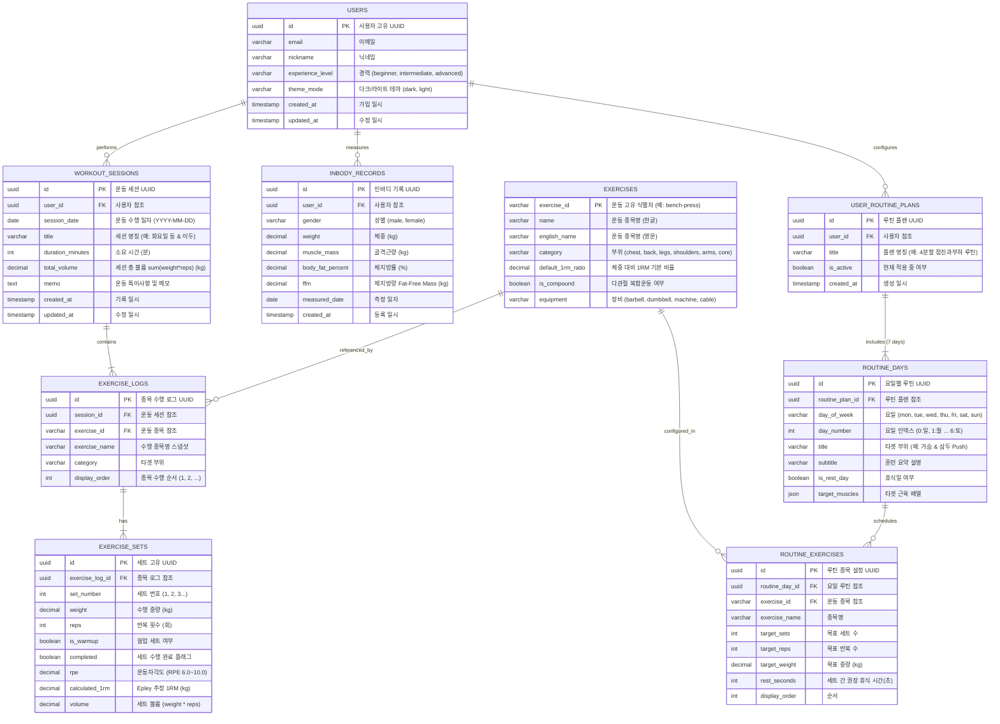

# FitPulse 데이터 모델 및 ERD (Entity Relationship Diagram) 명세서

본 문서는 FitPulse 서비스의 관계형 데이터베이스(PostgreSQL / MySQL) 및 클라이언트 캐시/저장 계층(IndexedDB / LocalStorage)을 위한 **엔티티 관계 다이어그램(ERD)**과 테이블 스키마 명세서입니다.

---

## 1. 개체-관계 다이어그램 (ERD - Mermaid Diagram)



---

## 2. 테이블별 상세 스키마 정의 (DDL Specification)

### 2.1 `WORKOUT_SESSIONS` (운동 세션)
| 컬럼명 | 데이터 타입 | 제약 조건 | 설명 |
| :--- | :--- | :---: | :--- |
| `id` | UUID | PK, NOT NULL | 세션 고유 식별자 |
| `user_id` | UUID | FK -> USERS(id) | 사용자 외래키 (인덱스) |
| `session_date` | DATE | NOT NULL | 세션 일자 (인덱스: 히트맵 잔디 추출용) |
| `title` | VARCHAR(100) | NOT NULL | 운동 명칭 |
| `duration_minutes` | INT | DEFAULT 0 | 운동 소요 시간 |
| `total_volume` | DECIMAL(10,2)| DEFAULT 0 | 완료된 세트의 총 볼륨 $\sum(weight \times reps)$ |
| `memo` | TEXT | NULL | 메모 |
| `created_at` | TIMESTAMP | DEFAULT NOW() | 생성 일시 |

### 2.2 `EXERCISE_LOGS` (운동 종목 수행 로그)
| 컬럼명 | 데이터 타입 | 제약 조건 | 설명 |
| :--- | :--- | :---: | :--- |
| `id` | UUID | PK, NOT NULL | 종목 로그 식별자 |
| `session_id` | UUID | FK -> WORKOUT_SESSIONS(id) | 운동 세션 외래키 (CASCADE) |
| `exercise_id` | VARCHAR(50) | FK -> EXERCISES(exercise_id)| 표준 운동 종목 ID |
| `exercise_name` | VARCHAR(100) | NOT NULL | 기록 당시 종목명 스냅샷 |
| `category` | VARCHAR(20) | NOT NULL | `chest`, `back`, `legs`, `shoulders`, `arms`, `core` |
| `display_order` | INT | DEFAULT 1 | 세션 내 종목 순서 |

### 2.3 `EXERCISE_SETS` (세부 세트 및 중량/반복수)
| 컬럼명 | 데이터 타입 | 제약 조건 | 설명 |
| :--- | :--- | :---: | :--- |
| `id` | UUID | PK, NOT NULL | 세트 식별자 |
| `exercise_log_id`| UUID | FK -> EXERCISE_LOGS(id) | 종목 외래키 (CASCADE) |
| `set_number` | INT | NOT NULL | 1세트, 2세트... |
| `weight` | DECIMAL(6,2) | NOT NULL | 중량 (kg, 2.5kg 단위 권장) |
| `reps` | INT | NOT NULL | 반복 횟수 |
| `completed` | BOOLEAN | DEFAULT FALSE | 세트 완료 체크 (볼륨 산입 기준) |
| `is_warmup` | BOOLEAN | DEFAULT FALSE | 웜업 세트 여부 |
| `rpe` | DECIMAL(3,1) | NULL | 운동자각도 (Rate of Perceived Exertion) |
| `calculated_1rm`| DECIMAL(6,2) | GENERATED ALWAYS | Epley 공식: $Weight \times (1 + Reps/30)$ |

### 2.4 `ROUTINE_DAYS` & `ROUTINE_EXERCISES` (요일별 분할 루틴)
- **7-Day Strip**과 1:1 매핑되어 사용자가 요일을 누르면 해당 요일에 사전 설정된 `target_weight`, `target_sets`, `target_reps`를 즉각 로드.
- `is_rest_day = true`일 경우 휴식 및 근합성 리커버리 모드로 UI 전환.

### 2.5 `INBODY_RECORDS` (체성분 및 추천 엔진 소스)
- `weight`, `muscle_mass`, `body_fat_percent`를 기반으로 제지방량(FFM)과 근육충실도(MF)를 연산하여 `EXERCISES`의 부위별 계수와 결합, 3대 운동(SBD) 및 보조 종목의 **웜업 / 본세트 / 스트렝스 중량(2.5kg 반올림)**을 산출.

---

## 3. 주요 인덱스 및 쿼리 최적화 전략
1. **히트맵 (Heatmap) 조회**:
   ```sql
   CREATE INDEX idx_workout_sessions_user_date ON WORKOUT_SESSIONS(user_id, session_date DESC);
   ```
   16주(112일)간의 날짜별 볼륨 집계를 `session_date BETWEEN ... AND ...`로 $O(\log N)$ 인덱스 스캔.
2. **지난 세션 대비 점진적 과부하 (Progressive Overload) 볼륨 비교**:
   ```sql
   SELECT total_volume, session_date 
   FROM WORKOUT_SESSIONS 
   WHERE user_id = $1 AND title LIKE '%등%' AND session_date < $2 
   ORDER BY session_date DESC LIMIT 1;
   ```
