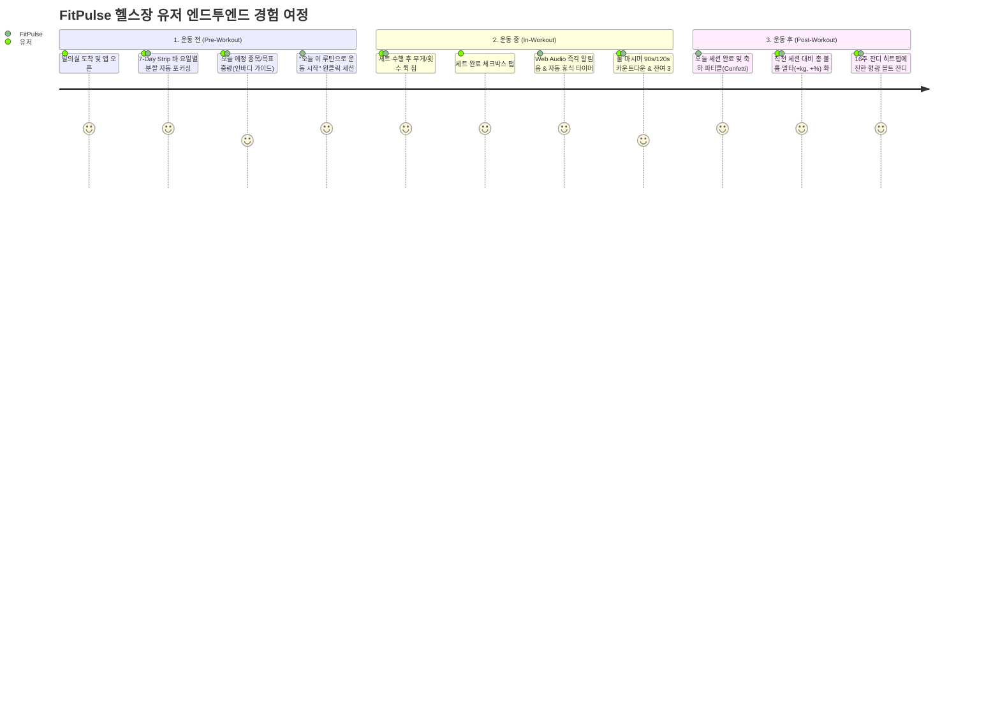

# FitPulse 사용자 경험(UX) 리서치 및 베타테스터 설문조사 명세서
> **문서 버전**: v1.0.0  
> **작성 일자**: 2026-09-09  
> **작성자**: FitPulse 수석 프로덕트 매니저 & 유저 리서처 (`product_research_agent`)  
> **협업 에이전트**: `design_agent` (UI/UX), `qa_agent` (아키텍처/품질보증)  
> **대상 플랫폼**: Web & Mobile Web (390px 스마트폰 뷰포트 최적화)

---

## 1. PM/리서처 디스커션: Design & QA 점검 결과 피드백

동료 에이전트(`design_agent`, `qa_agent`)의 정밀 점검 결과는 FitPulse가 추구하는 **"헬스장 현장에서 끊김 없는 점진적 과부하 트래커"**의 핵심 가치를 성공적으로 뒷받침하고 있습니다. 이에 대한 프로덕트 매니지먼트 및 사용자 심리(UX Psychology) 관점의 분석과 상호 토론 코멘트를 정리합니다.

### 1.1 `design_agent` 점검에 대한 피드백
1. **팬톤 2288 C Volt (`#CCFF00`) & Deep Obsidian Carbon의 고대비(18.2:1)**
   - **PM 평가**: 헬스장의 딤(Dim) 조명, 클럽형 조명(붉은/푸른 톤), 그리고 고중량 리프팅 직후 터널 비전(시야 흐려짐) 상태인 리프터에게 최대 시인성을 제공하는 최적의 컬러 시스템입니다.
   - **리서치 체크포인트**: 다만 창가 랙이나 주간 야외 채광 하에서 글레어(반사광)가 발생할 때 순수 블랙 배경과 형광 볼트의 눈부심 피로도가 누적될 수 있으므로, **"조명 환경별 가독성 및 눈의 피로도"**를 설문 문항에 반영합니다.
2. **390px 1-Column 모바일 레이아웃 및 텍스트 찌그러짐 방지(Anti-Squish)**
   - **PM 평가**: 기존 피트니스 앱들의 고질병이었던 "표(Table) 형태 가로 스크롤 붕괴"와 "모바일 텍스트 줄바꿈 찌그러짐"을 `whitespace-nowrap`과 전용 1-열 카드로 방어한 것은 훌륭한 엔지니어링-디자인 정합성입니다.
   - **리서치 체크포인트**: 44px+ 터치 타겟이 한 손으로 폰을 쥐고(Thumb Zone) 조작할 때 엄지손가락 가동 범위(Fitts' Law) 내에 자연스럽게 들어오는지 검증 문항을 배치합니다.

### 1.2 `qa_agent` 점검에 대한 피드백
1. **오프라인 영속성 (LocalStorageService) & 지하 헬스장 환경 방어**
   - **PM 평가**: 대다수 대형 피트니스 센터는 지하 1~2층에 위치하여 LTE/5G 음영 구역이 빈번합니다. 네트워크 단절 시에도 세트 기록, 타이머, 루틴 데이터가 100% 온디바이스에서 보존되는 아키텍처는 유저 이탈을 막는 핵심 방어벽입니다.
   - **리서치 체크포인트**: 세션 종료 전 앱 이탈, 브라우저 새로고침, 실수로 인한 데이터 유실 공포가 완전히 해소되었는지 심리적 안정감을 측정합니다.
2. **Web Audio API 무외부 의존성 사운드 & 휴식 타이머 연동**
   - **PM 평가**: 네트워크 레이턴시나 외부 MP3 CDN 실패 리스크를 제로화한 Web Audio 신디사이징(D5-A5 딩동음, 틱 비프, 종료 3연타)은 환상적인 반응성을 보장합니다.
   - **리서치 체크포인트**: 헬스장에서 90% 이상의 유저가 블루투스 이어폰(에어팟, 버즈)으로 음원을 스트리밍하고 있습니다. 백그라운드 브라우저 정책(AudioContext suspended) 및 음악 재생 중 사운드 오버랩/덕킹(Ducking) 체감을 질문에 포함합니다.
3. **인바디 맞춤 중량의 2.5kg 단위 반올림(Rounding)**
   - **PM 평가**: 실제 헬스장 올림픽 바벨 플레이트는 1.25kg, 2.5kg, 5kg 단위로 존재하므로, 이론적 수치(예: 73.4kg)가 아닌 2.5kg 단위 실전 플레이트 규격(예: 72.5kg 또는 75kg) 매핑은 리프터의 인지 부하를 획기적으로 줄여줍니다.

---

## 2. FitPulse 핵심 유저 여정 (User Journey Framework)

---

## 3. FitPulse 베타테스터 사용자 설문조사 설계 (Survey Specification)

### 3.1 설문 개요
- **설문명**: FitPulse 모바일 웹 베타테스터 사용성 및 만족도 조사 (v1.2)
- **조사 대상**: 주 2회 이상 헬스장 웨이트 트레이닝을 수행하는 베타테스터 (목표 표본: N = 50~100명)
- **예상 소요 시간**: 약 4~5분
- **조사 목적**: 
  1. 실제 헬스장 고중량/땀/혼잡 환경에서의 조작성 및 시인성 검증
  2. 7-Day 분할 플래너, 볼륨 델타, 16주 잔디의 '점진적 과부하 동기부여' 효과성 측정
  3. 국제 표준 SUS (System Usability Scale) 점수 산출 및 NPS 추천 의향 도출
  4. 향후 React Native 네이티브 앱 전환 시 우선 구현할 킬러 기능 도출

---

### [섹션 1] 응답자 기본 정보 및 운동 패턴 (User Persona)

**Q1. 평소 웨이트 트레이닝(헬스) 경력은 어떻게 되시나요?**
- ① 6개월 미만 (헬스 입문/초보)
- ② 6개월 이상 ~ 2년 미만 (초중급자)
- ③ 2년 이상 ~ 5년 미만 (중급자)
- ④ 5년 이상 (상급자/리프터)

**Q2. 일주일에 평균 몇 회 헬스장에 방문하여 운동하시나요?**
- ① 주 1~2회
- ② 주 3~4회
- ③ 주 5~6회
- ④ 주 7회 (매일)

**Q3. 현재 주로 진행하시는 훈련 분할 방식은 무엇인가요?**
- ① 무분할 (전신)
- ② 2분할 (상체/하체 or 푸시풀)
- ③ 3분할 (가슴삼두 / 등이두 / 하체어깨)
- ④ 4분할 이상 (세분화 부위 분할)
- ⑤ 특별한 분할 없이 당일 컨디션에 따라 즉흥 운동

**Q4. FitPulse 사용 전, 운동 기록을 어떤 방식으로 관리하셨나요? (복수 선택 가능)**
- [ ] 머릿속으로만 기억
- [ ] 스마트폰 기본 메모장 (Notion, iOS 메모 등)
- [ ] 기존 피트니스 앱 (번핏, 플렉, 헤비 등)
- [ ] 종이 운동 수첩 / 일지
- [ ] 기록하지 않음

---

### [섹션 2] 운동 중 현장 사용성 및 인터랙션 (In-Gym UX)

> *실제 헬스장 운동 중(땀, 장갑 착용, 거친 호흡, 한 손 조작) 환경을 떠올리며 답변해주세요.*

**Q5. 390px 모바일 화면에서 한 손(엄지손가락)으로 무게/반복수 퀵 칩(`-2.5kg`, `+2.5kg`, `+5kg`)과 증감 스테퍼를 조작하기 편리했습니까?**
- ① 매우 불편했다
- ② 다소 불편했다
- ③ 보통이다
- ④ 편리했다
- ⑤ 매우 편리했다
- *(주관식 선택)* 손이 닿지 않거나 터치가 빗나간 영역이 있었다면 적어주세요: [               ]

**Q6. 세트 완료 체크 시 자동으로 작동하는 'Web Audio 알림음'과 '휴식 타이머(90초/120초)'에 대한 경험은 어떠셨나요?**
- ① 소리/타이머가 불필요하거나 방해되었다
- ② 타이머는 좋았으나 사운드는 거슬렸다
- ③ 보통이다
- ④ 세트 완료 피드백과 다음 세트 대기 관리에 큰 도움이 되었다
- ⑤ 매우 만족스러우며 집중력이 극대화되었다

**Q7. 블루투스 이어폰(음악 청취 중) 착용 환경이나 헬스장 소음 속에서 휴식 타이머 종료음이 적절하게 인지되었습니까?**
- ① 전혀 들리지 않았다 (추가 진동/화면 깜빡임 필요)
- ② 음악 소리에 묻혀 가끔 놓쳤다
- ③ 적당한 크기로 명확히 인지되었다
- ④ 이어폰 없이 스마트폰 스피커로도 충분했다
- ⑤ 무음 모드로만 사용하여 오디오를 체감하지 못했다

**Q8. 헬스장의 어두운 조명(OLED 다크모드) 환경에서 'Pantone 2288 C 형광 볼트' 컬러의 가독성과 시인성은 어떠했습니까?**
- ① 눈이 부시거나 피로했다
- ② 다소 시인성이 떨어졌다
- ③ 보통이다
- ④ 중요한 수치와 액션이 한눈에 들어와 쾌적했다
- ⑤ 지금까지 써본 피트니스 앱 중 시인성이 가장 압도적이었다

**Q9. 지하 헬스장(통신 불량)이나 운동 도중 앱을 잠시 내렸다가 돌아왔을 때, 데이터가 유실되지 않고 안전하게 유지되었습니까?**
- ① 데이터가 날아가거나 초기화된 적이 있다 (구체적 상황 제보 요망)
- ② 로딩이 지연되어 불안했다
- ③ 데이터 유실 없이 매끄럽게 보존되었다
- ④ 매우 안정적이었다

---

### [섹션 3] 주간 분할 루틴 및 성장 분석 체감 (Motivation & Growth)

**Q10. 상단 '7-Day 요일 스트립 바'에서 오늘 요일(TODAY)을 자동 감지하고, 해당 루틴을 바로 시작하는 동선은 얼마나 직관적이었습니까?**
- ① 매우 헷갈리고 복잡했다
- ② 다소 헤맸다
- ③ 보통이다
- ④ 직관적이고 오늘 할 운동을 바로 알 수 있어 편리했다
- ⑤ 완벽히 직관적이며 운동 준비 시간이 단축되었다

**Q11. 운동 완료 후 '직전 세션 대비 총 볼륨 증감 델타(+kg, +%)' 수치는 점진적 과부하(Overload)를 체감하는 데 도움이 되었습니까?**
- ① 전혀 도움 되지 않았다
- ② 별다른 느낌이 없었다
- ③ 보통이다
- ④ 지난번보다 더 들었는지 수치로 즉각 확인되어 성취감이 컸다
- ⑤ 다음 운동 때 중량을 올리게 만드는 강력한 동기부여가 되었다

**Q12. 개발자의 GitHub 잔디를 오마주한 '16주 잔디 히트맵'은 헬스장 출석 및 운동 지속에 긍정적인 자극이 됩니까?**
- ① 전혀 자극되지 않는다
- ② 별다른 관심이 없다
- ③ 보통이다
- ④ 잔디가 채워지는 시각적 재미가 있어 출석 동기가 생긴다
- ⑤ 연속 출석(Streak)을 깨뜨리기 싫어서라도 헬스장에 가고 싶어진다

---

### [섹션 4] 인바디 맞춤 중량 추천기의 신뢰도 및 유용성

**Q13. 체중/골격근량/체지방률을 입력했을 때 제시되는 '3대 운동(SBD) 및 웜업/본세트 추천 중량'은 본인의 실제 수행 능력과 얼마나 일치했습니까?**
- ① 실제 들 수 있는 무게와 너무 동떨어져 있었다 (너무 무겁거나 가벼움)
- ② 다소 괴리가 있었다
- ③ 대체로 비슷했다 (±5~10% 오차 범위)
- ④ 매우 정확하게 나의 본세트 무게와 일치했다
- ⑤ 인바디를 측정하지 않아 사용해보지 않았다

**Q14. 추천 중량이 '2.5kg 단위(상용 바벨 원판 규격)'로 자동 반올림되어 표기되는 방식은 실제 세팅에 편리했습니까?**
- ① 0.5kg/1kg 단위의 세밀한 미세 중량이 필요하다
- ② 보통이다
- ③ 헬스장 원판 조합에 딱 맞아 직관적이고 계산이 필요 없어 매우 편리했다

---

### [섹션 5] 국제 표준 시스템 사용성 척도 (SUS: System Usability Scale)

> *각 문항에 대해 솔직하게 1(전혀 동의하지 않음)부터 5(매우 동의함)까지 선택해주세요.*

| 번호 | 설문 문항 | 1 (전혀 아님) | 2 | 3 (보통) | 4 | 5 (매우 동의) |
|---|---|:---:|:---:|:---:|:---:|:---:|
| **SUS-01** | 나는 FitPulse를 앞으로 정기적으로 사용하고 싶다. | □ | □ | □ | □ | □ |
| **SUS-02** | 나는 FitPulse가 불필요하게 복잡하다고 느꼈다. *(역코딩)* | □ | □ | □ | □ | □ |
| **SUS-03** | 나는 FitPulse가 사용하기 매우 쉽다고 생각했다. | □ | □ | □ | □ | □ |
| **SUS-04** | 나는 이 시스템을 사용하기 위해 전문가의 기술적 지원이 필요할 것 같다. *(역코딩)* | □ | □ | □ | □ | □ |
| **SUS-05** | 나는 FitPulse의 다양한 기능들이 매우 잘 통합되어 있다고 느꼈다. | □ | □ | □ | □ | □ |
| **SUS-06** | 나는 이 시스템에 너무 많은 모순과 일관성 없는 점이 있다고 느꼈다. *(역코딩)* | □ | □ | □ | □ | □ |
| **SUS-07** | 나는 대부분의 사람들이 이 시스템을 매우 빠르게 배울 수 있을 것이라 상상한다. | □ | □ | □ | □ | □ |
| **SUS-08** | 나는 이 시스템을 사용하는 것이 매우 성가시고 번거롭다고 느꼈다. *(역코딩)* | □ | □ | □ | □ | □ |
| **SUS-09** | 나는 이 시스템을 사용하는 데 있어 매우 자신감을 느꼈다. | □ | □ | □ | □ | □ |
| **SUS-10** | 나는 이 시스템을 원활하게 쓰기 전에 많은 것을 새로 배워야 했다. *(역코딩)* | □ | □ | □ | □ | □ |

> *참고: SUS 점수 계산 공식 = 홀수 문항 점수(값 - 1) 합 + 짝수 문항 점수(5 - 값) 합 × 2.5 (100점 만점 환산, 68점 이상 시 Good, 80점 이상 시 Excellent)*

---

### [섹션 6] 순추천고객지수(NPS) 및 심층 정성 피드백

**Q15. FitPulse를 주변의 동료 헬스인, 친구, 지인에게 추천할 의향이 얼마나 있으십니까? (NPS: 0~10점)**
- `0점 (전혀 추천하지 않음)` ~ `10점 (무조건 강력 추천)`
  - [ 0 ] [ 1 ] [ 2 ] [ 3 ] [ 4 ] [ 5 ] [ 6 ] [ 7 ] [ 8 ] [ 9 ] [ 10 ]
  - *(0~6점: 비추천 고객 Detractor / 7~8점: 수동 중립자 Passive / 9~10점: 적극 추천자 Promoter)*

**Q16. 위 추천 점수를 주신 가장 결정적인 이유는 무엇인가요?**
- 주관식 서술: [                                                                       ]

**Q17. FitPulse를 사용하시면서 가장 만족스러웠던 기능이나 디자인 요소는 무엇이었나요?**
- 주관식 서술: [                                                                       ]

**Q18. 헬스장에서 실제로 운동할 때 가장 불편했거나 개선이 시급하다고 느낀 점은 무엇인가요? (사소한 버그, 터치 미스, 문구 어색함 등)**
- 주관식 서술: [                                                                       ]

**Q19. 향후 정식 모바일 앱(React Native) 출시 시 가장 먼저 추가되기를 희망하는 기능은 무엇인가요? (우선순위 순서대로 선택 또는 자유 기입)**
- [ ] 애플워치 / 갤럭시워치 실시간 세트 기록 및 심박수 연동
- [ ] 스마트폰 화면이 꺼져도 알림이 오는 백그라운드 푸시 & 다이내믹 아일랜드
- [ ] RPE (운동자각도) 및 RIR (예비반복수) 세밀 기록
- [ ] 친구와 주간 볼륨 및 잔디를 대결하는 소셜/크루 챌린지
- [ ] 바벨 리프팅 궤적 추적 및 1RM 갱신 축하 기능
- [ ] 기타 의견: [                                                                     ]

---

## 4. 설문 분석 및 프로덕트 로드맵 반영 계획 (PM 액션 플랜)

1. **정량 지표 목표치 설정**:
   - **SUS 점수**: 80.0점 이상 (A등급 / Excellent 달성 목표)
   - **NPS 지수**: +40 이상 (Promoter 비율 55% 이상 확보)
   - **모바일 한 손 조작 만족도**: 긍정 응답(4~5점) 85% 이상
2. **이슈 트래킹 및 즉시 개선 체계**:
   - Q5(터치 빗나감), Q7(오디오 미인지), Q9(데이터 불안) 항목에서 부정 피드백(1~2점) 발생 시 `qa_agent` 및 `design_agent`와 즉각적인 Hotfix 스프린트 진행.
   - Q13(인바디 추천 중량 괴리) 피드백은 윌크스/도슨 공식 및 체성분 가중치 알고리즘 튜닝에 반영.
3. **정식 앱 런칭 파이프라인**:
   - Q19의 희망 기능 1순위를 바탕으로 React Native 전환 스프린트 백로그(Backlog) P0 티켓 확정.
